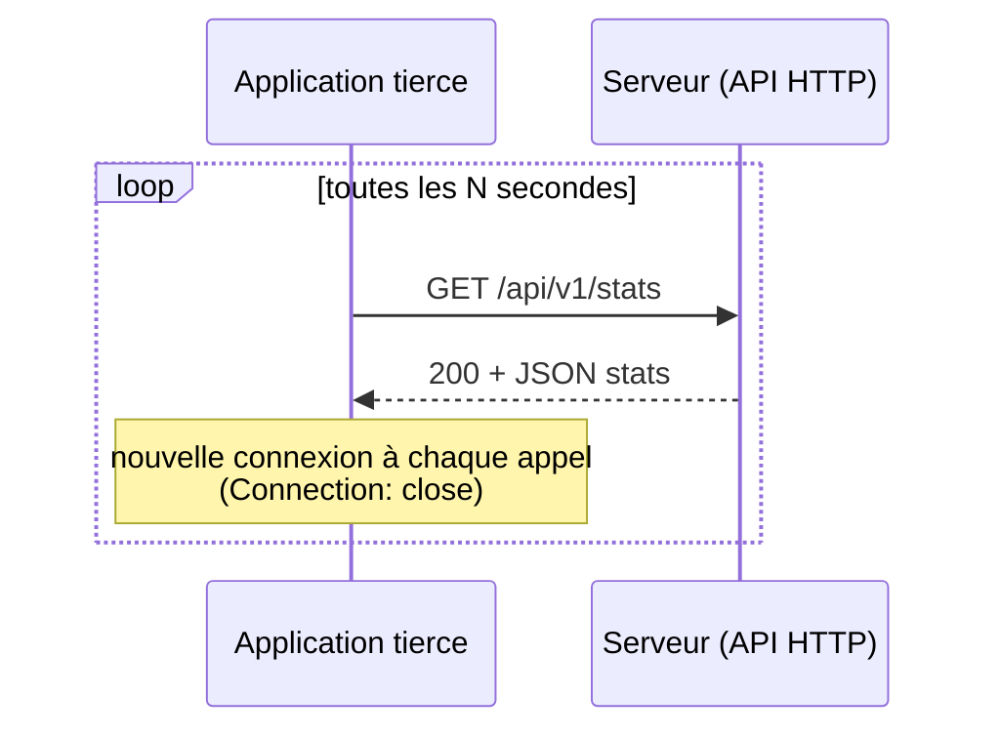
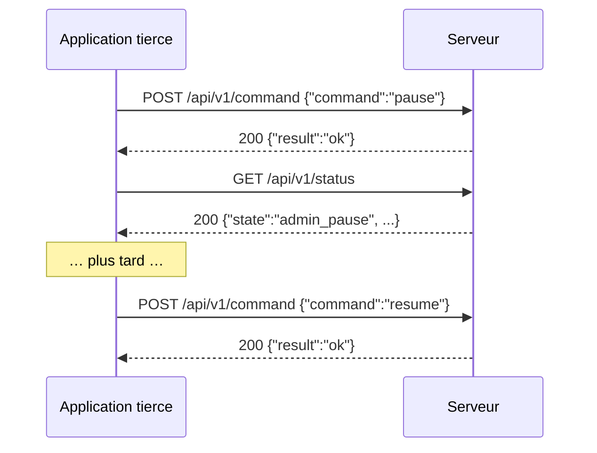
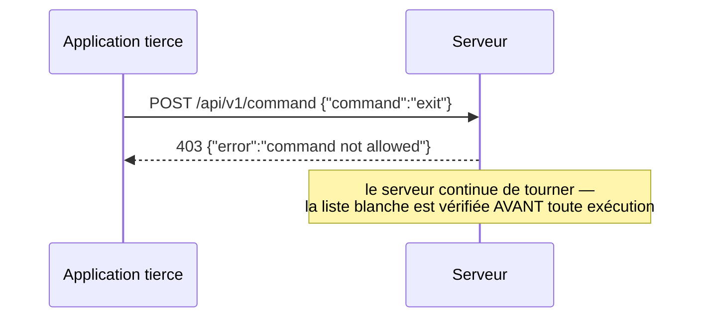

# API HTTP REST admin

Ce document décrit l'API HTTP REST exposée par le serveur (`tcpserver`) quand il est
lancé avec l'option `--http-port <n>` : une interface texte (JSON sur HTTP/1.1),
pensée pour qu'une application tierce — dans **n'importe quel langage** — puisse lire
la télémétrie et piloter quelques commandes admin **sans parler le protocole binaire**
(`packet`/`possibility_packet`, [échanges client/serveur](echanges_client_serveur.md))
ni le [canal de contrôle](echanges_client_serveur.md#canal-de-contrôle-v9) (v9,
réservé aux processus client eternityII).

Le code correspondant vit dans :

- [src/net/http_codec.h](../src/net/http_codec.h) / [http_codec.c](../src/net/http_codec.c) — parsing HTTP/1.1, routage, formatage JSON : fonctions pures, sans socket ;
- [src/net/http_server.h](../src/net/http_server.h) / [http_server.c](../src/net/http_server.c) — écouteur réseau (thread détaché, boucle accept) ;
- [src/ui/command_lines.c](../src/ui/command_lines.c) (`admin_apply_remote_command`) — exécution des commandes admin, réentrante ;
- [src/net/control_protocol.c](../src/net/control_protocol.c) (`control_command_allowed`) — liste blanche des commandes, **partagée** avec le canal de contrôle binaire.

## Activation

Désactivée par défaut. À activer explicitement au démarrage du serveur :

```sh
./eternityII tcpserver 4 --http-port 8080 data/pieces.csv
```

`--http-port` est une option position-indépendante (comme `--expand-level`), retirée
d'`argv` avant l'analyse positionnelle des arguments du mode. Une valeur absente ou
hors de l'intervalle `[1, 65535]` est **ignorée silencieusement** (l'API reste
désactivée) plutôt que d'ouvrir un port au hasard.

## Posture de sécurité

- **Écoute en boucle locale uniquement** (`127.0.0.1`, jamais `0.0.0.0`/`INADDR_ANY`) :
  l'API n'est **jamais** exposée hors de la machine par défaut. Un accès distant passe
  par un tunnel SSH ou un reverse-proxy explicite, à la charge de l'opérateur.
- **Aucune authentification.** L'API est pensée pour un réseau de confiance (la
  machine elle-même, ou un tunnel authentifié en amont) — ne jamais l'exposer
  directement sur un réseau non maîtrisé.
- **Liste blanche stricte des commandes** (voir [POST /api/v1/command](#post-apiv1command))
  : `exit`, `restore`, `import` et toute autre commande destructrice sont **rejetées
  avant même d'être interprétées**, jamais atteignables depuis cette API.
- **Aucun fichier n'est servi** : pas de chemin de requête interprété comme un chemin
  disque, donc pas de risque de traversée de répertoire.

## Modèle réseau

Volontairement minimal — c'est une API d'administration occasionnelle, pas un serveur
web de production :

- **Une requête par connexion.** Chaque réponse porte `Connection: close` : le client
  doit ouvrir une nouvelle connexion TCP pour chaque appel (pas de keep-alive HTTP/1.1,
  pas de pipelining). La plupart des bibliothèques HTTP client gèrent ça de manière
  transparente (elles rouvrent une connexion si le serveur ferme).
- **Un seul thread accepteur**, requêtes traitées **séquentiellement**. Ne pas
  paralléliser les appels côté client : ils seront simplement mis en attente par le
  système d'exploitation (backlog TCP de 4), pas d'erreur, mais pas de gain non plus.
- **Requête plafonnée à 8 Ko** (en-têtes + corps compris) : au-delà, `413 Payload Too
  Large` sans tentative de lecture supplémentaire. Largement suffisant pour tous les
  usages de cette API (les corps de requête réels font quelques dizaines d'octets).
- **Timeout d'E/S de 5 s** par connexion : un client qui ouvre la connexion sans
  envoyer de requête complète, ou qui ne lit pas la réponse, voit sa connexion
  abandonnée côté serveur après ce délai.
- **Sous-ensemble HTTP/1.1** : ligne de requête + en-têtes + corps optionnel borné par
  `Content-Length`. Pas de `Transfer-Encoding: chunked`, pas de query string dans
  l'URL, pas de fragments. `Content-Length` est le seul en-ête interprété (recherche
  insensible à la casse).

## Format des réponses

Toute réponse a la forme :

```
HTTP/1.1 <code> <libellé>
Content-Type: application/json
Content-Length: <n>
Connection: close

<corps JSON>
```

| Code | Libellé | Sens |
|---|---|---|
| `200` | OK | Requête traitée avec succès |
| `400` | Bad Request | Requête HTTP malformée, ou `POST /api/v1/command` avec un champ `command` absent/invalide/aux arguments manquants |
| `403` | Forbidden | Commande reconnue mais hors de la liste blanche (ex. `exit`) |
| `404` | Not Found | Chemin inconnu |
| `405` | Method Not Allowed | Chemin connu, mauvaise méthode HTTP (ex. `POST /api/v1/stats`) |
| `413` | Payload Too Large | Requête (en-têtes + corps) dépassant 8 Ko |

Les corps d'erreur ont la forme `{"error":"<message>"}` ; un succès de commande
renvoie `{"result":"ok"}`. Les messages d'erreur sont informatifs mais **non
contractuels** (ne pas faire de correspondance exacte de chaîne côté client — se fier
au code de statut HTTP).

## Endpoints

### GET /api/v1/stats

Instantané de la télémétrie serveur courante.

```json
{
  "shots_per_second": 12345,
  "possibility_stock": 100,
  "checked_stock": 20,
  "analysed_stock": 5,
  "max_result": 42,
  "active_threads": 3,
  "pruner_checked": 0,
  "pruner_removed": 0,
  "queues": [
    { "file": 0, "unchecked": 10, "checked": 2, "analysed": 1 },
    { "file": 1, "unchecked": 8,  "checked": 0, "analysed": 0 }
  ]
}
```

| Champ | Type | Sens |
|---|---|---|
| `shots_per_second` | entier ≥ 0 | Débit de recherche courant (essais/seconde), même valeur que le bandeau `coups/s` de la console — publié toutes les 10 s, donc granularité de mise à jour de cet ordre |
| `possibility_stock` | entier ≥ 0 | Total des possibilités **non vérifiées** en stock (somme des 10 files) |
| `checked_stock` | entier ≥ 0 | Total des possibilités **vérifiées** en attente de service |
| `analysed_stock` | entier ≥ 0 | Total des possibilités dans le pool **en cours d'analyse** (distribuées aux pruners, pas encore acquittées) |
| `max_result` | entier ≥ 0 | Meilleur résultat atteint (nombre de cases placées), 0 à 256 (ou 0 à 16 en build `ETERN_PARTS=16`) |
| `active_threads` | entier ≥ 0 | Nombre de connexions clients actuellement servies (canal de travail **et** de contrôle confondus, cf. [dimensionnement](echanges_client_serveur.md#impact-sur-le-dimensionnement-du-serveur)) |
| `pruner_checked` / `pruner_removed` | entier ≥ 0 | Toujours `0` côté serveur (ces compteurs n'existent que côté processus pruner ; conservés dans le schéma pour rester alignable avec `control_stats_t` du canal de contrôle) |
| `queues` | tableau de 10 objets | Une entrée par file interne (`NB_FILE_POSSIBILITY`), avec ses trois compteurs par pool. L'ordre des entrées suit l'index de file (0 à 9), pas garanti trié par une autre clé |

### GET /api/v1/status

Instantané de l'état et de la configuration courante.

```json
{
  "state": "admin_pause",
  "uptime_seconds": 3600,
  "version": 9,
  "limit": 1000,
  "max_stock_by_thread": 500,
  "pruner_batch": 64
}
```

| Champ | Type | Sens |
|---|---|---|
| `state` | chaîne | Voir tableau ci-dessous |
| `uptime_seconds` | entier ≥ 0 | Secondes écoulées depuis le démarrage de l'API HTTP (pas depuis le démarrage du serveur, qui la précède de quelques instants) |
| `version` | entier | Numéro de version du protocole **binaire** (`VERSION`, actuellement 9) — informatif uniquement : l'API HTTP n'est pas versionnée avec lui (voir [Compatibilité](#compatibilité)) |
| `limit` | entier ≥ 0 | Débit de recherche maximum configuré (essais/seconde) ; `0` = illimité |
| `max_stock_by_thread` | entier | Seuil de stock local par thread avant délégation au serveur |
| `pruner_batch` | entier | Taille de lot d'échange du pruner courante |

Valeurs possibles de `state` :

| Valeur | Sens |
|---|---|
| `running` | Recherche active (`REQUEST_CONTINUE`) |
| `admin_pause` | Pause administrative posée par la commande `pause` (ou `POST /api/v1/command {"command":"pause"}`) — ne se lève que par `resume` |
| `regulation_pause` | Pause de régulation de débit interne (`limit`), levée automatiquement par le régulateur — pas une action externe |
| `stopping` | Arrêt du serveur en cours (`exit` a été demandé par un autre canal — jamais atteignable via cette API, voir liste blanche) |
| `unknown` | Valeur de repli, ne devrait jamais apparaître en usage normal |

### POST /api/v1/command

Exécute une commande admin whitelistée.

**Requête :**

```json
{ "command": "limit 1000" }
```

`command` est une chaîne unique contenant le nom de la commande et, le cas échéant,
son argument, séparés par un espace — exactement comme sur la console interactive du
serveur. **Limitation volontaire de l'extracteur JSON** : les échappements
(`\"`, `\\`, `\uXXXX`, …) ne sont **pas** supportés dans la valeur de `command` et
provoquent un `400` plutôt qu'une interprétation incorrecte ; ce n'est pas gênant en
pratique car toutes les commandes whitelistées n'utilisent que `[A-Za-z0-9 ]`.

**Commandes acceptées** (`control_command_allowed`, identique à la liste blanche du
[canal de contrôle](echanges_client_serveur.md#double-vérification-de-la-liste-blanche)) :

| Commande | Effet |
|---|---|
| `pause` | Pose une pause administrative (`state` devient `admin_pause`) |
| `resume` | Lève une pause administrative posée par `pause` |
| `limit <n>` | Fixe le débit maximum de recherche à `n` essais/seconde (`0` = illimité) |
| `maxStockByThread <n>` | Fixe le seuil de stock local par thread |
| `prunerBatch <n>` | Fixe la taille de lot du pruner, bornée à `[1, PRUNER_BATCH_MAX]` (65536) — une valeur hors borne est silencieusement ramenée à la borne la plus proche, pas un `400` |

Toute autre commande — en particulier `exit`, `restore`, `import` — est **rejetée
avant même d'être tokenisée**, avec `403`.

**Réponses :**

| Cas | Code | Corps |
|---|---|---|
| Commande whitelistée, appliquée | `200` | `{"result":"ok"}` |
| Commande hors liste blanche | `403` | `{"error":"command not allowed"}` |
| Champ `command` absent, vide, mal formé (JSON invalide, échappement) | `400` | `{"error":"missing or malformed \"command\" field"}` |
| Commande reconnue mais argument manquant (ex. `"limit"` sans nombre) | `400` | `{"error":"missing or invalid argument"}` |

**Exécution non bloquante pour les autres canaux.** La commande est appliquée par
`admin_apply_remote_command` (et non par la fonction console `do_command_line`, qui
utilise un curseur de tokenisation global non réentrant) : un appel HTTP concurrent à
une saisie sur la console interactive, ou à une commande poussée via le
[canal de contrôle](echanges_client_serveur.md#canal-de-contrôle-v9), ne corrompt
jamais le découpage de l'autre.

## Séquences typiques

### Polling de télémétrie



### Pause / reprise administrative



### Commande refusée



## Exemples d'implémentation client

### curl

```sh
curl http://127.0.0.1:8080/api/v1/stats
curl http://127.0.0.1:8080/api/v1/status
curl -X POST -d '{"command":"limit 1000"}' http://127.0.0.1:8080/api/v1/command
```

### Python (bibliothèque standard, sans dépendance)

```python
import json
import urllib.request

BASE = "http://127.0.0.1:8080/api/v1"

def get_stats():
    with urllib.request.urlopen(f"{BASE}/stats", timeout=5) as r:
        return json.load(r)

def send_command(command):
    body = json.dumps({"command": command}).encode()
    req = urllib.request.Request(f"{BASE}/command", data=body, method="POST")
    try:
        with urllib.request.urlopen(req, timeout=5) as r:
            return r.status, json.load(r)
    except urllib.error.HTTPError as e:
        return e.code, json.load(e)

print(get_stats())
print(send_command("pause"))
```

### Notes générales pour tout langage

- Utiliser une bibliothèque HTTP/1.1 standard : rien de spécifique au protocole n'est
  requis côté client, c'est du JSON sur HTTP classique.
- Ne pas réutiliser une connexion entre deux appels (`Connection: close` — la plupart
  des clients HTTP le gèrent automatiquement et rouvrent une connexion).
- Traiter tout code hors `200` comme un échec métier (403/404/405) ou de forme
  (400/413), et lire le corps JSON `{"error": "..."}` pour le diagnostic — sans faire
  de correspondance exacte de message (non contractuel, voir plus haut).
- Poser un timeout côté client (le serveur en pose un de 5 s de son côté, mais un
  client sans timeout propre resterait bloqué en cas de coupure réseau asymétrique).

## Compatibilité

Cette API est un **port TCP indépendant** de celui du protocole binaire de travail
(`SERVER_PORT`, 2020 par défaut) et du canal de contrôle (multiplexé sur ce même
port). Elle n'a **aucun impact** sur le handshake de version `VERSION` du protocole
binaire ([échanges client/serveur](echanges_client_serveur.md#handshake-de-version)) :
activer `--http-port` ne change rien pour les clients/pruners eternityII existants, et
inversement, aucun client/pruner n'a besoin d'être mis à jour pour qu'un serveur
commence à exposer cette API.

Le champ `version` de `GET /api/v1/status` est purement informatif — cette API HTTP
elle-même n'est pas encore versionnée (`/api/v1/...` réserve la place pour une
évolution future si le besoin apparaît, mais aucun `/api/v2/` n'existe à ce jour).
