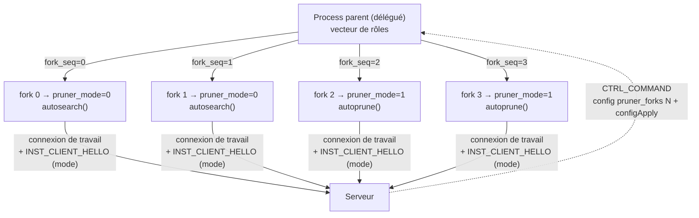

# Pilotage du rôle des fils client depuis le serveur

> **Statut : proposition.** Ce document décrit une **cible**, pas le comportement
> actuel du code. Rien de ce qui suit n'est implémenté à ce jour. Voir
> [README.md](README.md) pour la convention de ce répertoire.

## 1. Le problème

Un process client est aujourd'hui **soit** un chercheur **soit** un pruner, et ce
choix est figé par `argv[1]` au lancement (`main.c:124-143`). Il ne change plus
jamais : `pruner_mode` est écrit une seule fois (`main.c:129`) puis lu comme une
constante ambiante par le reste du programme.

L'opérateur doit donc décider **à l'avance, machine par machine**, quelle part de
son parc va à la recherche et quelle part à l'élagage — alors que le seul acteur
qui connaisse le besoin réel est le **serveur**, et que ce besoin varie dans le
temps.

Les deux erreurs de dosage ont un coût mesuré :

- **Trop peu de pruners.** Le contrôle superficiel qu'un pruner exécute
  (`possibility_all_has_a_next_counted`) rejette déjà **50,2 %** d'un stock produit
  par un client à ordre fixe, et **16,3 %** d'un stock produit par un client MRV
  (mesure `bench_refutation --pruner-profile`, cf.
  [../utilisation.md](../utilisation.md#mode-pruner-élagage)). Sans pruner, le
  serveur distribue donc jusqu'à une possibilité sur deux qui est **déjà morte** :
  du stock qui occupe de la RAM, traverse le réseau, et consomme du CPU client pour
  rien.
- **Trop de pruners.** Un pruner affamé n'a **aucun repli** : `scroll_from_local_tocheck`
  (`src/core/datamanager.c:1896-1899`) ne consulte que le pool non vérifié, sans le
  repli sur le pool vérifié dont bénéficie un chercheur (`scroll_from_local`,
  `:1879-1886`). Dès que `Σ file_size(f) == 0`, un pruner tourne à vide en back-off
  (50 ms → 500 ms) pendant qu'un chercheur, au même instant, aurait eu de quoi
  travailler.

**La question posée** : le client peut-il devenir un simple **délégué**, dont le
serveur fixe le dosage recherche/contrôle **fork par fork** ?

## 2. Ce qui existe déjà (et rend l'opération bon marché)

L'enquête préalable a établi trois faits qui changent radicalement le coût estimé
de la fonctionnalité.

### 2.1 `client` et `pruner` sont déjà le même programme

Les deux modes appellent **la même** fonction d'entrée `handle_client()`
(`src/app/main.c:202`), qui ne contient **aucun** test de mode : même parsing, même
chargement de configuration, même identité, même map partagée, même orchestrateur,
mêmes threads parents. La divergence tient en **cinq sites** :

| # | Site | Divergence |
|---|---|---|
| 1 | `src/app/app_runtime.c:441,448,461` | sens des arguments positionnels (`argv[4]`/`argv[5]`) |
| 2 | `src/app/app_runtime.c:918-921` | octet `mode` de l'identité déclarée |
| 3 | `src/app/etii_client.c:179` | demander 1 racine vs un lot de `pruner_batch_size` |
| 4 | **`src/app/etii_client.c:538-542`** | **`autoprune()` vs `autosearch()` — la vraie bifurcation** |
| 5 | `src/core/datamanager.c:1661` | `INST_GET_TO_CHECK_BATCH` vs `INST_GET` |

Tout le reste qui *paraît* spécifique au pruner est soit du code partagé
(`send_possibility_analysed` utilise `pruner_batch_size` comme plafond de tranche
**dans les deux modes**), soit une branche d'affichage (`fork_diagnostic_summary`,
`src/app/fork_orchestrator.c:158-181`).

Corollaire utile : la divergence protocolaire est **plus étroite que la
documentation ne le laisse croire**. Seul le **verbe d'acquisition** diffère.
`INST_ADD` est émis par les deux — un pruner réinjecte ses survivants avec
`checked = 1` par le même `add_possibility` (`src/core/etii_search.c:1418-1423`) —
et `INST_POSSIBILITY_ANALYSED[_BATCH]`, `INST_NEED_WORK`, `INST_SOLUTION`,
`INST_CLIENT_HELLO` aussi.

### 2.2 Les forks sont des processus, pas des threads

`orchestrator_spawn_forks` (`src/app/fork_orchestrator.c:491`) crée de vrais
processus ; chaque enfant exécute `spawn_child_body(fork_seq)` (`:468`) puis
`run_client` → `run_mono_client`. **`pruner_mode` est donc déjà, physiquement, une
valeur par fork** : chaque enfant possède sa propre copie de la globale.

Il suffit de l'écrire **dans la branche fille**, en tête de `spawn_child_body`, pour
que les cinq sites du §2.1 lisent la bonne valeur — sans en toucher un seul.



### 2.3 Le type circule déjà sur le fil, par connexion

`client_identity_t.mode` (`src/net/client_identity.h:42-46` :
`CLIENT_MODE_SEARCH`/`CLIENT_MODE_PRUNER`/`CLIENT_MODE_GPU_PRUNER`) est présent
depuis **v12** dans les deux hellos. Or le hello de **travail**
(`INST_CLIENT_HELLO`) est émis **par fork** — c'est précisément le rôle de son
`fork_seq`, et le serveur le range dans `client_t.identity` / `client_t.has_identity`.

Aujourd'hui cet octet est uniforme parce que sa source
(`init_client_identity`, `src/app/app_runtime.c:918-921`) est résolue une fois
avant tout fork. **Rien dans le format ne l'impose.** Un dosage mixte se déclare
donc **sans aucun bump de `VERSION`** : le serveur n'a qu'à agréger
`client_t.identity.mode` par `client_uid`.

### 2.4 Le canal de commande est déjà en place

`config`, `configApply`, `configSave`, `start` et `stopForks` sont **déjà** dans
`control_command_allowed` (`src/net/control_protocol.c:188-200`), donc déjà
poussables du serveur vers un client précis :

```
clientsCommand --to jetson-1 config nb_forks 8
clientsCommand --to jetson-1 configApply
```

Et le patron d'un **état désiré côté serveur, qui survit à une reconnexion**,
existe déjà sous la forme de `g_desired_pause_state`
(`src/app/control_registry.c:66`) : une session qui s'enregistre se voit
**pré-poster** la commande dans sa file toute neuve (`:133-142`), avant même son
premier `CTRL_PING`. C'est exactement le mécanisme dont le dosage de rôles a
besoin.

## 3. Cible proposée

Le client devient un **délégué** : il n'a plus d'opinion sur ce qu'il doit faire,
il héberge `nb_forks` processus de travail et applique un **vecteur de rôles** que
le serveur lui indique.

Le dosage est représenté par un seul entier, `pruner_forks` ∈ `[0, nb_forks]` : le
nombre de fils affectés au contrôle du stock. Les `nb_forks − pruner_forks` autres
cherchent. Les deux cas dégénérés (`0` et `nb_forks`) reproduisent exactement le
comportement actuel des modes `client` et `pruner` — ce qui garantit qu'aucun
déploiement existant ne change de comportement.

## 4. Découpage en PR

Chaque PR est livrable seule, et **aucune ne touche le format du fil**.

### PR1 — rôle par fork, décidé localement

Le mécanisme, sans aucune intervention du serveur. Après cette PR, un opérateur
peut déjà lancer `./eternityII client srv 8 --pruner-forks 2`.

- Fonction **pure** `fork_role_for(fork_seq, nb_forks, pruner_forks)` →
  `FORK_ROLE_SEARCH` / `FORK_ROLE_PRUNE`. Isolée et testable, comme
  `orchestrator_step` ou `compute_server_hunger`.
- En **tête** de `spawn_child_body` (`src/app/fork_orchestrator.c:468`), dans la
  branche fille : écriture de `pruner_mode` et recalcul de
  `g_client_identity_template.mode`. Aucun des cinq sites du §2.1 n'est modifié.
  L'ordre importe : après `status_zone_disown_child()`, avant tout `log_*`.
- Nouvelle clé de configuration `pruner_forks` (`src/app/client_config.{h,c}`),
  classée **`NEEDS_RESTART`** aux côtés de `nb_forks` (`client_config.c:345-362`) —
  un changement de rôle implique un re-fork (§5.2).
- Option CLI `--pruner-forks <n>`, **avec son entrée dans `cli_topics[]`**
  (exigence `AGENTS.md` : la table est la source unique de vérité de l'aide).
- `fork_diagnostic_summary` reçoit le rôle **du fork `c`** au lieu de la globale du
  parent — deux appelants (`fork_orchestrator.c:761`, `ui/command_lines.c:908`).
- **Rien à faire côté agrégats** : `struct client_statistics`
  (`src/app/etii_statistic.h`) porte déjà *à la fois* les compteurs de recherche
  (`shots_per_second`, `max_result`…) et de prunage (`pruner_checked`,
  `pruner_removed`, `pruner_cells_per_second`), et `control_channel_build_stats`
  (`src/app/etii_control.c:58-75`) les somme déjà sur tous les forks. Un process
  mixte remonte donc des statistiques correctes sans une ligne de plus.

Tests : `fork_role_for` (pure, y compris les bornes `0`, `nb_forks`, valeur hors
plage) ; clé de configuration et sa classification `NEEDS_RESTART` ; parsing CLI.

### PR2 — le serveur mesure le besoin par rôle

Le serveur ne peut pas encore décider : il lui manque les métriques. Cette PR
comble quatre trous constatés, **indépendamment** de tout pilotage.

- **Compteurs de service à vide — le trou principal.** Aujourd'hui un `K = 0` ne
  laisse *aucune* trace : ni compteur, ni log. `counters[]`, `fileUpdates[]` et
  `analysedFileUpdates[]` ne sont incrémentés que par possibilité **effectivement
  servie**. Or les deux handlers sont déjà distincts —
  `INST_GET` (`src/app/etii_server.c:689`) et `INST_GET_TO_CHECK[_BATCH]`
  (`:715`, `:739`) — donc la famine se ventile **naturellement par rôle**, sans
  aucune inférence. C'est la mesure la plus directe du besoin.
- **Ventilation du débit ADD/GET par pool.** `stock_adds_rate`/`stock_removes_rate`
  (`src/core/datamanager.c:42-43`) mélangent aujourd'hui les deux pools : impossible
  de dire si les GET consommés viennent du pool non vérifié (pruners) ou vérifié
  (chercheurs). `scroll_from_pool` (`:1771`) **reçoit déjà le pool en paramètre** :
  une seconde paire de compteurs suffit.
- **Agrégation du parc par mode.** `control_registry_snapshot()[].mode` porte déjà
  la donnée ; personne ne la compte. Un `nb_search` / `nb_prune` par machine et
  global.
- **Exposition** : console `statistic` et `GET /api/v1/stats`.

À ce stade, un opérateur voit enfin *pourquoi* il faudrait rééquilibrer.

### PR3 — pilotage explicite par l'opérateur

Le pilotage de base **fonctionne déjà** dès la PR1, sans une ligne de plus :

```
clientsCommand --to jetson-1 config pruner_forks 2
clientsCommand --to jetson-1 configApply
```

Cette PR apporte les deux choses qui manquent :

- **Ergonomie** : `clientsRoles [--to <cible>] <nb_pruner>`, qui compose les deux
  commandes ci-dessus. Comme toute commande serveur agissant sur
  `control_registry`, elle rejoint `control_command_classify` en
  `CTRL_CMD_WRITE_RELAYABLE` — un seul point à toucher
  (`src/net/control_protocol.c:185-216`).
- **Persistance du dosage désiré**, calquée sur `g_desired_pause_state` : un client
  qui se reconnecte (ou redémarre) reprend le dosage voulu par le serveur sans
  qu'il faille rejouer la commande. C'est ce qui fait passer le client du statut de
  « client reconfigurable » à celui de **délégué**.

### PR4 — politique automatique (désactivée par défaut)

- Fonction **pure** `compute_desired_role_mix(...)`, sur le modèle exact de
  `compute_server_hunger` (`src/app/etii_server.c:54`) : aucun état, aucune I/O,
  entièrement testable.
- Entrées : `Σ file_size(f)` (travail disponible pour un pruner),
  `Σ file_checked_size(f)` (travail disponible pour un chercheur), ratio
  `datamanager_resident_packets() / datamanager_ram_limit_packets()` comparé à
  `STOCK_SPILL_HIGH_PERCENT` (`src/core/stock_spill.h:70`), famines par rôle (PR2),
  parc par mode (PR2).
- Branchée dans le tour de 10 s de `check_server_step` — pas de nouvelle cadence.
- Garde-fous, tous à consigner comme partie du contrat :
  - **hystérésis** et **délai minimal** entre deux changements : chaque changement
    coûte un `stopForks` + re-fork chez le client, pas une bascule gratuite ;
  - **jamais 0 chercheur** : sans producteur, le stock ne se régénère pas et
    l'ensemble du parc converge vers l'arrêt ;
  - **jamais 100 % pruner** pour la même raison ;
  - **désactivée par défaut** (`--auto-roles`) — l'opérateur garde la main, et la
    politique doit faire ses preuves avant d'être imposée.

## 5. Arbitrages tranchés

### 5.1 Rôle par fork, pas par process
C'est la demande, et c'est **gratuit** (§2.2). Un dosage par process obligerait à
dédier des machines entières à un rôle, ce qui reproduit le problème d'origine à
une granularité à peine plus fine.

### 5.2 Re-fork plutôt que bascule à chaud
Le changement de dosage passe par le chemin **existant** `orchestrator_do_stop_forks`
+ `orchestrator_apply_restart_config` (`src/app/fork_orchestrator.c:785-848`), dont
la quiescence coopérative et la règle « jamais dans le doute » (un timeout de
quiescence annule *tout* le redémarrage plutôt que de risquer une reconstruction
partielle) sont déjà éprouvées en production. Le flush du stock local à l'arrêt
existe depuis la PR #228.

Une bascule à chaud (§6) est possible mais introduit un risque neuf dans du code
dont chaque invariant a été payé par un incident. Elle n'est pas justifiée tant que
la fréquence réelle des changements de dosage n'est pas mesurée.

### 5.3 Aucun bump de `VERSION` sur PR1-PR4
Le `mode` par connexion de travail (§2.3) porte déjà l'information. **Écarté** :
ventiler `control_stats_t` par rôle (ajouter `nb_search_forks`/`nb_prune_forks`)
imposerait un bump — `CONTROL_STATS_WIRE_SIZE` est une taille fixe — pour une
information que le serveur peut déjà déduire. Un bump de protocole se paie au
déploiement (handshake en égalité stricte) : il doit apporter quelque chose
d'indéductible.

### 5.4 Pas de mixte GPU
Le contexte CUDA n'est pas hérité par `fork()` : `gpu_pruner_init` doit tourner
**dans l'enfant** (`src/app/etii_client.c:526-533`). Un dosage mixte sur une machine
GPU ferait initialiser un contexte CUDA par fork pruner, pour un gain nul (le GPU
est déjà saturé par un seul). **Arbitrage** : `--gpu` force
`pruner_forks = nb_forks`, avec un message explicite si l'opérateur demande autre
chose — jamais un repli silencieux.

### 5.5 Opérateur d'abord, automatique ensuite
Même discipline que MRV et le DFS borné du pruner : le mécanisme d'abord, la mesure
ensuite, l'automatisation en dernier — et seulement si la mesure la justifie. Le
dépôt a déjà écarté trois propositions d'élagage sur cette base
([elagage_recherche.md](elagage_recherche.md) §4.2, §4.3, §4.4).

## 6. Points laissés ouverts

- **Bascule à chaud sans re-fork.** `autosearch` (`src/core/etii_search.c:1273`) et
  `autoprune` (`:1480`) ne sortent aujourd'hui que sur `REQUEST_STOP`. Un sentinel
  supplémentaire (`REQUEST_ROLE_SWITCH`), consommé par une boucle de répartition
  autour de `etii_client.c:538`, permettrait de changer de rôle sans re-fork. Deux
  difficultés à traiter : vider proprement le stock local du fork (un chercheur qui
  devient pruner tient des possibilités que personne ne réclamerait) et son pool
  analysé (sans quoi les baux d'expiration devront les récupérer). **À trancher
  après mesure de la fréquence réelle des changements**, pas avant.
- **Quelle métrique arbitre le dosage ?** La question est ouverte à dessein. Le
  précédent `bench-refutation` a montré qu'un mauvais critère (débit brut,
  `max_result`) fait prendre la mauvaise décision là où le bon critère (coût de
  réfutation à CPU égal) la renverse. Candidats à évaluer : décroissance du stock
  mort, coût de réfutation global du parc, temps avant saturation RAM. Aucun n'est
  retenu ici.
- **Granularité du dosage.** `pruner_forks` est un entier global au process. Une
  variante « le serveur envoie un vecteur de rôles explicite » serait plus
  expressive mais n'a, à ce stade, aucun cas d'usage identifié.

## 7. Relevé hors périmètre

`CONTROL_COMMAND_LINE_MAX` est défini **deux fois avec deux valeurs** : 512 dans
`src/app/etii_control.c:28` (buffer de réception client) et 256 dans
`src/app/control_registry.h:40` (slot de file serveur, et buffer d'émission de
`control_session_step`, `src/app/etii_server.c:1222`). Les deux unités de
compilation ne s'incluant pas mutuellement, il n'y a ni avertissement ni erreur —
mais la borne effective de bout en bout est **255 caractères**, avec troncature
silencieuse dans `control_registry_post_command`. Sans conséquence pour les
commandes actuelles (la plus longue est très en deçà), à corriger hors de cette
série.
