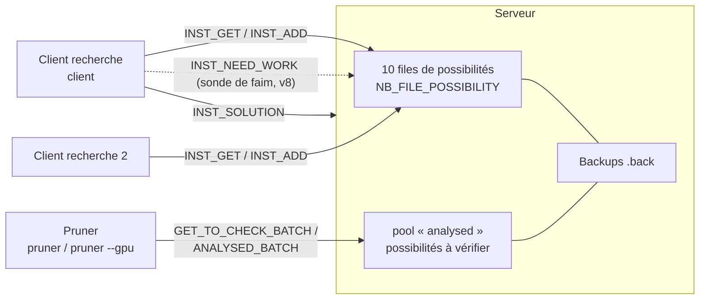
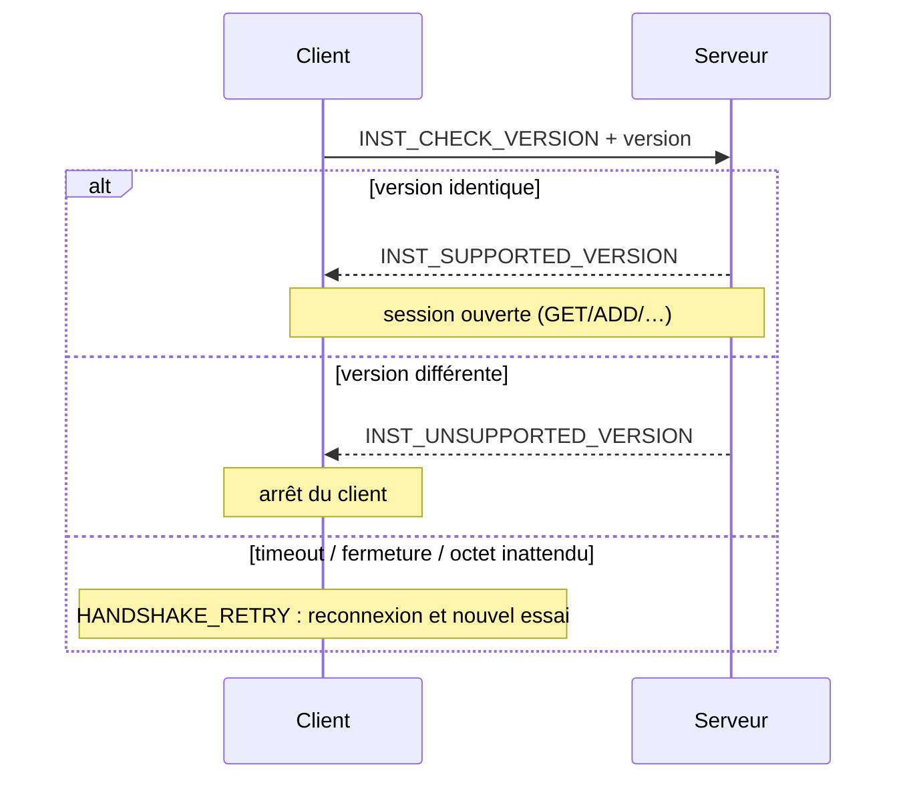
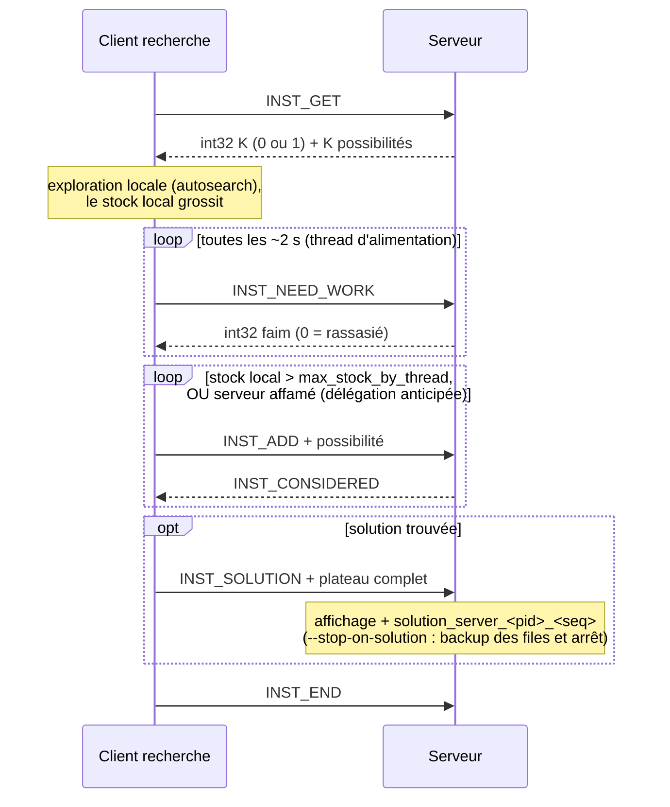
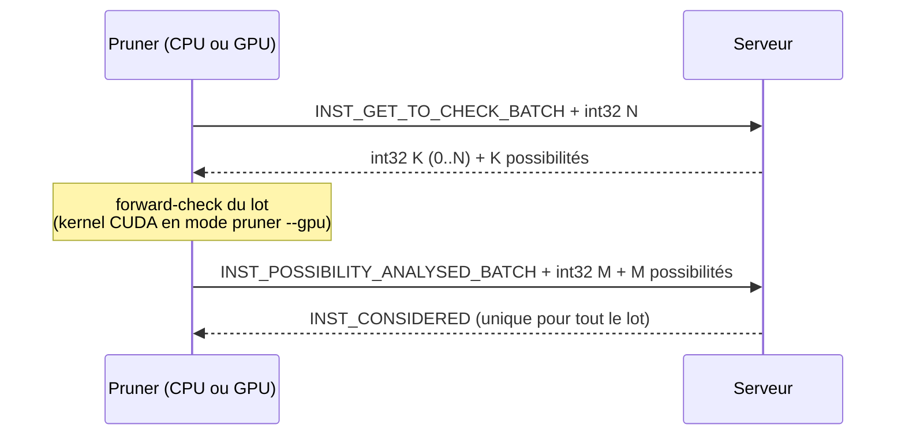
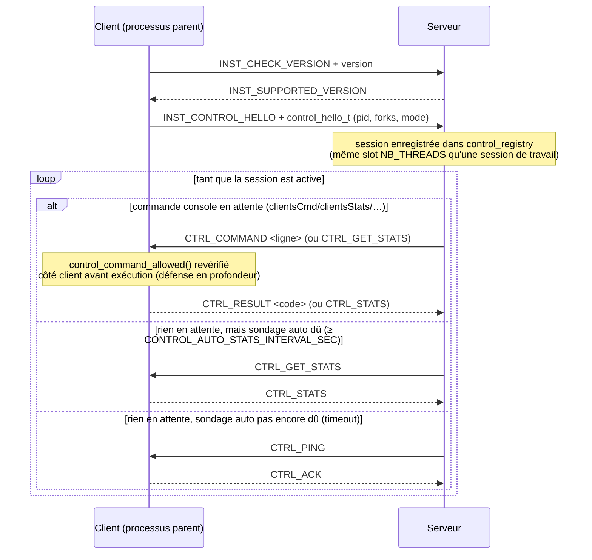
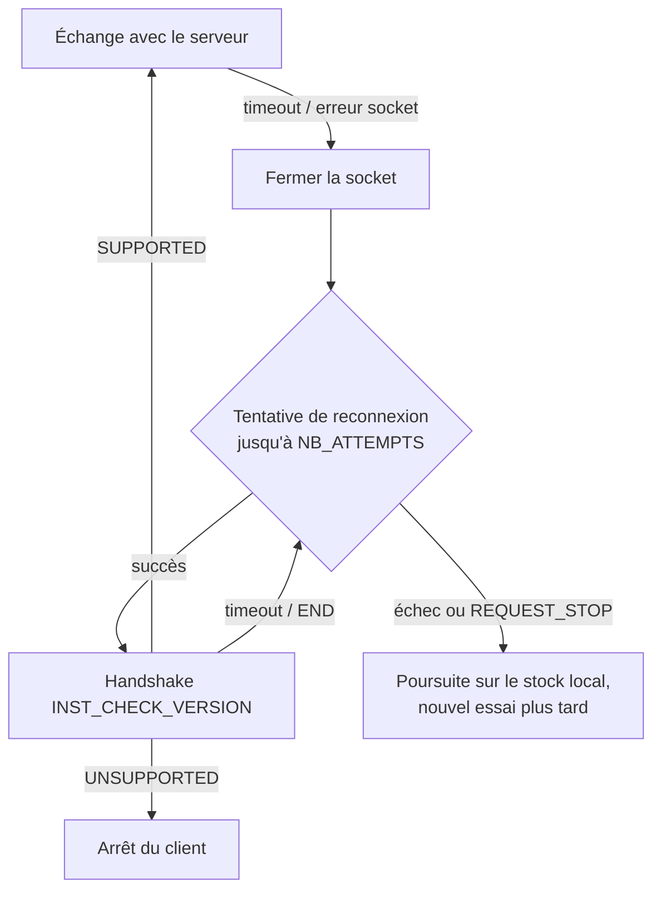

# Échanges client / serveur

Ce document décrit le protocole TCP qui relie le serveur (`server`) aux différents
clients (`client`, `pruner`, `pruner --gpu`) : les instructions échangées, la gestion
de charge, les séquences de communication typiques et le comportement en cas de panne.
Il couvre aussi (depuis la v9) le [canal de contrôle](#canal-de-contrôle-v9), une
connexion TCP séparée où le **serveur** devient l'initiateur pour piloter un client à
distance (statistiques, pause/reprise, …).

Le code correspondant vit principalement dans :

- [src/net/etii_protocol.h](../src/net/etii_protocol.h) / [etii_protocol.c](../src/net/etii_protocol.c) — instructions du protocole de travail, `send_all`/`recv_all`, handshake ;
- [src/net/client.c](../src/net/client.c) / [server.c](../src/net/server.c) — sockets et timeouts ;
- [src/core/datamanager.c](../src/core/datamanager.c) — files de possibilités côté serveur et échanges côté client ;
- [src/app/etii_server.c](../src/app/etii_server.c) / [etii_client.c](../src/app/etii_client.c) — boucles de traitement du protocole de travail ;
- [src/net/control_protocol.h](../src/net/control_protocol.h) / [src/app/etii_control.c](../src/app/etii_control.c) / [src/app/control_registry.c](../src/app/control_registry.c) — canal de contrôle (v9), détaillé plus bas.

## Vue d'ensemble

Le serveur détient le stock global de **possibilités** (états de plateau partiels,
`struct possibility_packet`). Les clients de recherche en retirent (`INST_GET`), les
explorent localement, et redéposent l'excédent (`INST_ADD`). Les pruners retirent des
possibilités *non vérifiées* par lots, les valident (forward-check), puis signalent
celles à éliminer.

Chaque échange est un `packet` de taille fixe : un octet d'`instruction` suivi, selon
l'instruction, d'un `possibility_packet` (~520 octets). Depuis la version 7 du
protocole, **tous** les transferts de paquets passent par `send_all`/`recv_all`, qui
réassemblent les envois TCP partiels (voir [Robustesse](#comportement-en-cas-de-problème)).

## Types d'instructions

| Constante | Valeur | Sens | Rôle |
|---|---|---|---|
| `INST_ADD` | 1 | client → serveur | Dépose une possibilité (réponse : `INST_CONSIDERED`) |
| `INST_GET` | 2 | client → serveur | Demande une possibilité ; réponse : `int32` K + K paquets (K ∈ {0, 1}) |
| `INST_SOLUTION` | 3 | client → serveur | Envoie un plateau complet ; le serveur l'affiche et le sauvegarde |
| `INST_END` | 4 | bidirectionnel | Fin de session (aussi valeur de repli sur timeout de `recv_instruction`) |
| `INST_CONSIDERED` | 5 | serveur → client | Accusé de réception |
| `INST_NULL` | 6 | — | Hérité : plus émis depuis v7 (le compteur `int32` des réponses GET le remplace) |
| `INST_POSSIBILITY_ANALYSED` | 7 | pruner → serveur | Une possibilité vérifiée (unitaire) |
| `INST_TEST_CONNECTED` | 8 | client → serveur | Keepalive : le serveur renvoie la même instruction |
| `INST_CHECK_VERSION` | 9 | client → serveur | Ouverture du handshake de version |
| `INST_SUPPORTED_VERSION` | 10 | serveur → client | Version acceptée |
| `INST_UNSUPPORTED_VERSION` | 11 | serveur → client | Version refusée : le client s'arrête |
| `INST_GET_TO_CHECK` | 12 | pruner → serveur | Demande une possibilité non vérifiée (réponse : `int32` K + K paquets) |
| `INST_GET_TO_CHECK_BATCH` | 13 | pruner → serveur | Demande jusqu'à N possibilités en un aller-retour (`int32` N → `int32` K + K paquets) |
| `INST_POSSIBILITY_ANALYSED_BATCH` | 14 | pruner → serveur | Signale M possibilités analysées (`int32` M + M paquets → un seul `INST_CONSIDERED`) |
| `INST_NEED_WORK` | 15 | client → serveur | Sonde de faim (v8) : réponse `int32` N = nombre de possibilités que le serveur souhaiterait recevoir (0 = stock suffisant). Tient lieu de keepalive et pilote la [délégation anticipée](#gestion-de-charge) |
| `INST_CONTROL_HELLO` | 16 | client → serveur | Annonce (v9) : le processus **parent** du client (jamais un fork) ouvre une connexion TCP dédiée et bascule cette session en [canal de contrôle](#canal-de-contrôle-v9), où les rôles s'inversent |

Toute évolution du format « fil » impose d'incrémenter `VERSION` : le handshake exige
une correspondance exacte. La v11 bump ainsi `VERSION` sans ajouter de nouvelle
instruction : le nouveau parcours de plateau (`directions[]`/`dirx[]`/`diry[]`,
`src/app/static_variables.c`, pensé pour éliminer des possibilités plus tôt dans la
recherche) fait qu'un même indice de curseur (`alloc`) désigne une case différente
qu'en v10 — un `possibility_packet` échangé entre versions désynchroniserait
silencieusement le board plutôt que de planter, d'où le refus explicite au handshake.

### Handshake de version

À la connexion, le client envoie `INST_CHECK_VERSION` suivi de son numéro de version.

Point important : un `INST_END` reçu ici peut être un simple timeout de
`recv_instruction`, pas un refus — il est donc classé `HANDSHAKE_RETRY`, jamais
« version refusée ».

## Cycle de vie d'un client de recherche

## Cycle de vie d'un pruner (échanges par lots)

Le lot est borné par `pruner_batch_size` (4ᵉ argument CLI ou commande console
`prunerBatch <n>`, plafonné à `PRUNER_BATCH_MAX`), ce qui borne la mémoire du pruner
et divise le nombre d'allers-retours réseau par rapport au mode unitaire
(`INST_GET_TO_CHECK` / `INST_POSSIBILITY_ANALYSED`, conservé pour compatibilité).

## Canal de contrôle (v9, étendu en v10)

Au-dessus du protocole de travail décrit ci-dessus (toujours initié par le client :
GET/ADD/ANALYSED/…), une **seconde connexion TCP indépendante par processus client**
permet au **serveur** de piloter un client en cours d'exécution — demander ses
statistiques en direct, ou lui pousser une commande console (`pause`, `resume`,
`limit`, …) — sans jamais toucher aux threads de recherche.

Le code correspondant vit dans :

- [src/net/control_protocol.h](../src/net/control_protocol.h) / [control_protocol.c](../src/net/control_protocol.c) — codec des trames `CTRL_*`, structures `control_hello_t`/`control_stats_t`, liste blanche `control_command_allowed` ;
- [src/app/control_registry.h](../src/app/control_registry.h) / [control_registry.c](../src/app/control_registry.c) — registre serveur des sessions de contrôle actives ;
- [src/app/etii_control.h](../src/app/etii_control.h) / [etii_control.c](../src/app/etii_control.c) — thread client (processus **parent** uniquement) ;
- [src/app/etii_server.c](../src/app/etii_server.c) (`run_control_session`/`control_session_step`) — boucle serveur du canal ;
- [src/core/best_board.h](../src/core/best_board.h) / [best_board.c](../src/core/best_board.c) — mémorisation « premier à dépasser gagne » de la représentation du meilleur plateau, aux trois échelles fork/parent/serveur (v10).

### Qui l'ouvre, et pourquoi ça ne coûte rien à la recherche

Seul le processus **parent** du client (celui qui fork les threads de recherche,
jamais un fork lui-même) ouvre cette connexion — une par *processus* client, pas par
fork. Elle tourne sur son propre thread détaché (`run_control_channel`), entièrement
séparé des threads de recherche, du thread d'alimentation du protocole de travail et
des threads de statistiques/console. La seule chose que paie la boucle chaude de
recherche est la lecture (déjà existante) de la globale `request` à chaque nœud — rien
n'a été ajouté à cette boucle pour le canal de contrôle en tant que tel.

### Inversion des rôles

Après le handshake de version habituel, le client envoie `INST_CONTROL_HELLO` (pid,
nombre de forks, mode — `control_hello_t`) puis les rôles s'inversent : c'est
désormais le **serveur** qui prend l'initiative des échanges sur cette connexion.

### Format de trame

Un codec autonome, volontairement distinct de `packet`/`possibility_packet` (qui ne
transporte qu'un seul type de charge utile, et dont le struct `packed` garde du
padding caché — ne jamais le poser sur le fil sans passer par des champs explicites).
Chaque trame est `uint8_t cmd` + `int32_t len` + `len` octets de payload, toujours via
`send_all`/`recv_all` — jamais un `send`/`recv` brut, pour la même raison que le
protocole de travail. Une longueur hors borne (`< 0` ou `> CTRL_PAYLOAD_MAX` = 4000)
est rejetée sans tentative d'allocation.

| Commande `CTRL_*` | Valeur | Sens |
|---|---|---|
| `CTRL_PING` / `CTRL_ACK` | 1 / 2 | Keepalive émis par le serveur quand aucune commande n'est en attente |
| `CTRL_GET_STATS` / `CTRL_STATS` | 3 / 4 | Demande de statistiques agrégées ; réponse `control_stats_t` (coups/s, stock, analysé, `max_result`, pruner vérifiées/éliminées, cases prunées/s). Émis soit sur demande explicite (`clientsStats`/`POST /api/v1/clients/stats`), soit automatiquement au plus toutes les `CONTROL_AUTO_STATS_INTERVAL_SEC` (30 s) — voir ci-dessous |
| `CTRL_COMMAND` / `CTRL_RESULT` | 5 / 6 | Commande console poussée en texte ; réponse = code retour `int32` de `do_command_line()` |
| `CTRL_GET_BEST_BOARD` / `CTRL_BEST_BOARD` | 7 / 8 | *(v10)* Demande la représentation complète du meilleur plateau connu du client (agrégat de ses forks) ; réponse = `uint8_t valid` puis, si `valid`, `sizeof(struct possibility_packet)` octets bruts (même convention que le protocole de travail GET/ADD : struct copié tel quel, round-trip valide sur le même build) |

### Sondage automatique des statistiques

Avant cette fonctionnalité, `control_session_step` (`src/app/etii_server.c`) n'émettait
`CTRL_GET_STATS` qu'en réponse à une commande explicitement postée (`clientsStats`
console, ou `POST /api/v1/clients/stats` de l'API HTTP) — en son absence, la branche
timeout n'envoyait que des `CTRL_PING`/`CTRL_ACK`. Or c'est justement la **réception**
d'un `CTRL_STATS` qui déclenche le tirage du meilleur plateau
(`CTRL_GET_BEST_BOARD`, cf. plus bas) quand `max_result` dépasse le record déjà connu
du serveur : sans sondage périodique, un nouveau record côté client pouvait rester
invisible côté serveur indéfiniment, jusqu'à ce qu'un opérateur pense à lancer
`clientsStats` manuellement — potentiellement plusieurs minutes après son apparition.

`control_registry_auto_stats_due(session_index, CONTROL_AUTO_STATS_INTERVAL_SEC)`
(`src/app/control_registry.c`, intervalle 30 s défini dans `static_variables.h`) est
maintenant vérifié en premier dans la branche timeout : si dû, un aller-retour
`CTRL_GET_STATS`/`CTRL_STATS` (factorisé dans `control_session_poll_stats`, partagé
avec le chemin de commande explicite) remplace le `CTRL_PING` de ce tour — un nouveau
record se propage donc en au plus un intervalle, sans action opérateur. La marque
« dernière tentative » est posée sous le mutex de la session, indépendamment de
`stats_time` (qui ne bouge que sur un décodage réussi), pour qu'un échec transitoire ne
déclenche pas une nouvelle tentative au tour suivant.

### Meilleur plateau connu (`CTRL_GET_BEST_BOARD`/`CTRL_BEST_BOARD`, v10)

Les statistiques (`max_result`/`control_stats_t.max_result`) n'exposent que le
**nombre** de pièces placées au record — jamais l'agencement qui l'a produit, qui
continue d'être muté par le backtracking immédiatement après. `core/best_board.h`
comble ce manque avec une primitive « on ne garde que la première représentation qui
dépasse strictement le record déjà connu », réutilisée à trois échelles :

1. **Fork de recherche** (`g_search_best_board`) : mise à jour directement dans la
   boucle chaude (`etii_search.c`), en même temps que `max_result`.
2. **Processus parent client** (`g_client_aggregate_best_board`) : un fork qui bat
   son propre record envoie sa représentation au parent par IPC
   (`IPC_MSG_BEST_BOARD`, `src/net/ipc_protocol.h`) — jamais à chaque tour, seulement
   sur record, contrairement à `IPC_MSG_STATS`.
3. **Serveur** (`g_server_best_board`) : dans `control_session_step`
   (`src/app/etii_server.c`), juste après avoir décodé un `CTRL_STATS`, si le
   `max_result` rapporté dépasse le meilleur déjà connu du serveur, celui-ci envoie
   immédiatement `CTRL_GET_BEST_BOARD` **sur la même connexion** et attend
   `CTRL_BEST_BOARD` avant de rendre la main — c'est le serveur qui demande,
   uniquement quand il en a besoin, jamais le client qui pousse spontanément.

Le serveur applique la même règle « premier à dépasser gagne » à sa propre agrégation
(`best_board_try_record`), qu'il persiste avec le reste du stock (autobackup,
`eternityII-best_board.back`/`temp-best_board.back`) et expose via
[`GET /api/v1/best-board`](api_http_rest.md).

### Resynchronisation du `max_result` global du serveur sur `CTRL_STATS`

Avant tout correctif, le serveur exposait **trois** indicateurs de « meilleur résultat »
mis à jour par des chemins indépendants, sans jamais se recopier entre eux : le global
`max_result` (logs serveur, `GET /api/v1/stats`), alimenté **uniquement** par le
protocole de travail classique (`INST_ADD`/…, quand un client pousse effectivement ses
possibilités) ; le cache par-session (`control_registry_record_stats`, `GET
/api/v1/clients`), alimenté à chaque `CTRL_STATS` ; et `g_server_best_board` (`GET
/api/v1/best-board`), alimenté seulement sur un `CTRL_STATS` qui bat le record déjà
connu. Un client qui annonçait son record uniquement via le canal de contrôle (sans
transfert `INST_ADD` correspondant) faisait donc progresser les deux derniers sans que
le premier — celui affiché en logs serveur et par `/api/v1/stats` — ne bouge.
`control_session_step` (`src/app/etii_server.c`) met désormais aussi à jour le global
`max_result` dès qu'un `CTRL_STATS` rapporte une valeur strictement supérieure, en plus
du cache par-session et de `g_server_best_board` — les trois vues restent cohérentes
entre elles. Verrouillé par
`control_session_step_get_stats_updates_global_max_result`
(`tests/app/test_etii_server.c`).

### Double vérification de la liste blanche

Seules quelques commandes console sont déclenchables à distance
(`control_command_allowed`) : `pause`, `resume`, `limit`, `maxStockByThread`,
`prunerBatch` — jamais `exit`, `restore`, `import`, ni rien de destructeur. Cette
vérification est faite **deux fois indépendamment** : côté serveur dans l'interpréteur
de `clientsCmd` (qui refuse même de diffuser une ligne interdite), et, en défense en
profondeur, côté client dans `control_channel_handle_frame` avant tout appel à
`do_command_line` — le client ne fait jamais confiance à ce qui arrive sur ce socket
au seul motif que ça y arrive.

**`restore`/`backup` restent hors de portée de ce canal, quoi qu'il arrive.**
`control_command_privileged` (`src/net/control_protocol.c`) liste ces deux commandes
séparément de `control_command_allowed`, et **seule** l'[API HTTP admin](api_http_rest.md#authentification-restorebackup)
(`POST /api/v1/command`, après authentification par jeton Bearer via
`--http-token-file`) les consulte — jamais `control_channel_handle_frame` ni
`clientsCmd`. Élargir l'accès de l'API HTTP à ces deux commandes ne les rend donc
**pas** déclenchables à distance sur un client par ce canal : les deux vérifications
ci-dessus restent strictement bornées à la même liste `control_command_allowed`
qu'avant.

### Impact sur le dimensionnement du serveur

Une session de contrôle **partage le même pool `client_t[NB_THREADS]`** qu'une
session de travail classique — pas de pool de sockets séparé, seulement un registre
d'état indépendant (`control_registry`, 64 sessions max). Chaque processus client
consomme donc désormais **un slot serveur de plus** que le nombre de ses forks de
recherche. Avec un `NB_THREADS` serveur trop petit, la session de contrôle peut affamer
indéfiniment une session de travail (`request unfulfilled: all threads busy`) — c'est
la valeur par défaut (80) qui laisse une marge confortable en usage normal ; un
déploiement contraint doit dimensionner `NB_THREADS` pour (connexions de travail
simultanées) + (processus clients connectés), pas seulement le premier terme.

### Commandes console associées

Voir la [console interactive](console.md#commandes) pour la liste complète ; côté
serveur uniquement : `clients` (liste les sessions actives), `clientsStats` (diffuse
`CTRL_GET_STATS`), `clientsCmd <ligne>` (diffuse `CTRL_COMMAND`, filtré par la liste
blanche). `pause`/`resume` posent/lèvent localement `REQUEST_ADMIN_PAUSE` — un état
distinct de la pause de régulation de débit (`REQUEST_PAUSE`, auto-levée par le
régulateur), pour qu'une pause administrative ne disparaisse jamais toute seule au
tour suivant — **et** diffusent systématiquement `CTRL_COMMAND "pause"`/`"resume"` à
toutes les sessions de contrôle actives (fusion de l'ancien `clientsPause`/
`clientsResume`) : sur le serveur, où `request` n'a aucun effet local (aucune
recherche n'y tourne), c'est cette diffusion qui rend la commande utile ; sur un
client, `control_registry` est toujours vide, donc la diffusion y est un no-op
silencieux. L'état de pause désiré (`control_registry_desired_pause_state`) est
persisté : un client qui se connecte APRÈS un `pause` serveur démarre lui aussi en
pause, sans qu'il faille rejouer la commande.

## Gestion de charge

**Côté serveur — connexions simultanées configurables.** Le nombre de clients servis
en parallèle est le 1ᵉʳ argument de démarrage : `./eternityII server [nb_threads]`
(80 par défaut). Il dimensionne le pool de threads de communication — un thread par
connexion active — et sert aussi de backlog à `listen()`. Les slots sont créés
paresseusement : un client accepté est affecté à un slot libre, sinon un nouveau
slot est créé dans la limite de `NB_THREADS`. Si tous les slots sont occupés, la
boucle d'acceptation attend qu'un slot se libère (message « all threads busy »,
journalisé une seule fois par épisode d'attente) — la connexion reste en file, elle
n'est pas rejetée.

**Côté client — une connexion TCP par thread de recherche.** La connexion serveur
n'est **pas** partagée entre les workers : chaque contexte de recherche
(`client_possibility_t`, `src/app/etii_client.h`) possède son propre `socket_id`,
ouvert à la demande par `check_and_connect_to_server`. Un serveur avec N clients ×
M threads voit donc jusqu'à N×M connexions. Au sein d'un contexte, le socket est en
revanche partagé entre le thread de travail et le thread d'alimentation (qui émet la
sonde de faim / keepalive) : le mutex `socket_mutex` sérialise leurs échanges pour
qu'une séquence `send_instruction + send + recv ack` ne soit jamais entrelacée avec
une sonde.

**Côté client — seuil de stock local.** Chaque thread de recherche garde au plus
`max_stock_by_thread` possibilités en local (3ᵉ argument de `client`). Dès que son
stock implicite (les frères non explorés de sa pile de backtracking) dépasse ce seuil,
l'excédent est délégué au serveur via des `INST_ADD` (voir `src/core/etii_search.c`).
Le client reste ainsi autonome (peu d'allers-retours tant qu'il a du travail) tout en
alimentant le stock global.

**Sonde de faim et délégation anticipée (v8).** Le seuil seul laissait le serveur
affamé au démarrage : le paquet genèse part chez un premier thread dont le stock
implicite reste longtemps sous `max_stock_by_thread` — il ne délègue rien, pendant que
tous les autres clients reçoivent K=0 et reculent en back-off. Depuis la v8, le thread
d'alimentation du client sonde le serveur (`INST_NEED_WORK`, toutes les
`min(tcp_timeout/2, NEED_WORK_POLL_INTERVAL_S)` secondes, pour chaque thread occupé
disposant d'un socket) ; le serveur répond sa **faim** (`compute_server_hunger`,
`src/app/etii_server.c`) : le manque de stock distribuable par rapport à la cible
`SERVER_HUNGER_PER_CLIENT × sessions connectées`, plafonné à `SERVER_HUNGER_CAP`. La
faim est publiée dans la globale atomique `server_hunger` ; les threads de recherche la
lisent dans leur bloc de délégation déjà throttlé (1 M nœuds ET 500 ms) et, si elle est
positive, cèdent `min(faim, pending/2)` frères même sous le seuil
(`bt_delegation_quota`, `src/core/etii_search.c`) — jamais le chemin courant ni le
dernier frère. La faim est décrémentée du nombre envoyé, jusqu'à la prochaine sonde.
Coût pour la boucle chaude de recherche : aucun (une lecture atomique au plus 2×/s,
dans un bloc déjà exécuté à cette cadence).

**Expansion du stock au démarrage (`--expand-level`, pendant serveur).** La sonde de
faim ci-dessus traite la famine du démarrage *côté client* ; le serveur peut aussi la
prévenir *à la source*. Avec l'option `--expand-level N`, juste après avoir semé le
paquet genèse et avant toute connexion, le serveur **développe lui-même son stock**
(`expand_datas_to_level`, `src/core/datamanager.c`) : il place une pièce candidate sur
la case suivante de chaque possibilité jusqu'à ce que leur curseur `alloc` atteigne le
niveau `N`, transformant le paquet genèse en des milliers de possibilités
distribuables. Chaque client trouve alors du travail dès sa connexion. C'est un calcul
purement serveur (aucun échange, aucun impact client), borné en profondeur
(`EXPAND_MAX_LEVELS`, 4 passes) et en nombre (`EXPAND_MAX_STOCK`, plafond entre passes —
le vrai garde-fou, le facteur de branchement étant inconnu). La même opération est
disponible à chaud via la commande console `expand N`. Voir le
[mode serveur](utilisation.md#expansion-du-stock-au-démarrage---expand-level-anti-famine)
pour les niveaux recommandés (3–4).

**Côté serveur — files multiples.** Le serveur répartit les possibilités sur
`NB_FILE_POSSIBILITY` (10) files protégées chacune par un mutex
(`src/core/datamanager.c`) : plusieurs threads serveur peuvent servir des clients en
parallèle sans se contendre sur un verrou unique. Un pool séparé « analysed » contient
les possibilités en attente de vérification, servi en priorité aux pruners et, en
repli, aux clients de recherche.

**Réponses GET explicites.** Depuis la v7, une réponse à `INST_GET` /
`INST_GET_TO_CHECK` commence par un compteur `int32` : `0` signifie « rien de
disponible » sans ambiguïté, ce qui évite à un client de bloquer en attente d'un
paquet qui ne viendra pas. Si le serveur ne fournit rien (stock épuisé ou serveur
saturé), le client continue sur son stock local et retentera plus tard.

**Batching pruner.** Les instructions `*_BATCH` amortissent la latence réseau : un
aller-retour pour N possibilités au lieu de N allers-retours, avec un seul
`INST_CONSIDERED` d'acquittement pour tout le lot.

**Persistance.** Le serveur sauvegarde périodiquement (et à l'arrêt) ses files dans
`./eternityII.back` et `./eternityII-in_analyse.back`, et les restaure au démarrage :
la charge accumulée survit à un redémarrage.

## Comportement en cas de problème

### Serveur qui ne répond plus

- **Timeouts socket.** Le client arme `SO_RCVTIMEO`/`SO_SNDTIMEO` à `tcp_timeout`
  secondes sur sa socket (`src/net/client.c`). Un `recv` qui expire fait renvoyer
  `INST_END` par `recv_instruction` (errno `EAGAIN`/`EWOULDBLOCK`/`ETIMEDOUT`) : le
  client ne reste jamais bloqué indéfiniment sur un serveur muet.
- **Keepalive.** Un worker occupé sur son stock local peut ne rien envoyer pendant
  longtemps ; côté serveur, `tcp_timeout` d'inactivité fermerait la connexion
  (Broken pipe). Le thread d'alimentation émet donc la sonde de faim `INST_NEED_WORK`
  (toutes les `min(tcp_timeout/2, 2 s)` pendant les périodes d'inactivité) : l'échange
  réussi prouve la session vivante, et sa réponse pilote la délégation anticipée.
  Cela distingue « client silencieux mais vivant » de « client mort ».
  `INST_TEST_CONNECTED` reste utilisé pour les contrôles ponctuels de connexion
  (`is_connected`, avant de réutiliser un socket existant).
- **Détection côté client.** Si la sonde ou un échange échoue, le client détecte la
  perte au plus tard après `tcp_timeout`, oublie le socket et remet la faim à zéro
  (pas de délégation sur une information morte), puis passe en reconnexion.

### Connexion impossible / reconnexion

`connect_to_server` tente jusqu'à `NB_ATTEMPTS` connexions, avec une pause de 1 s
entre chaque essai — découpée en tranches de 100 ms qui vérifient `REQUEST_STOP`,
pour qu'un Ctrl-C pendant la reconnexion ne soit pas bloqué. Après le dernier échec,
la fonction renvoie `-1` et l'appelant continue en local (le stock du thread n'est
pas perdu ; il sera redéposé quand le serveur reviendra).

### Flux TCP désynchronisé

Un `send()`/`recv()` brut peut ne transférer qu'une partie d'un paquet de ~520 octets
et désynchroniser tout le flux (les octets suivants seraient interprétés comme des
instructions). C'est pourquoi **tous** les transferts de `possibility_packet` passent
par `send_all`/`recv_all`, qui bouclent jusqu'à transfert complet ou erreur franche.
`recv_all` distingue le timeout (réessayable) de la fermeture propre (`recv == 0`).

### Arrêt et pertes de données

- À l'arrêt (signal ou `--stop-on-solution` après réception d'une solution), le
  serveur **sauvegarde ses files** dans les fichiers `.back` avant de quitter et les
  recharge au prochain démarrage.
- Les solutions sont écrites dans des fichiers **uniques**
  (`solution_<pid>_<seq>` côté client, `solution_server_<pid>_<seq>` côté serveur) :
  deux solutions ne s'écrasent jamais, même en cas de course.
- Une possibilité confiée à un **pruner** n'est pas retirée définitivement : elle reste
  dans le pool « en analyse » (sauvegardé dans `eternityII-in_analyse.back`) jusqu'à
  l'acquittement `INST_POSSIBILITY_ANALYSED[_BATCH]`. Si le pruner meurt, la
  possibilité est toujours côté serveur et sera resservie.
- Une possibilité remise à un **client de recherche** (`INST_GET`) est transférée : si
  ce client meurt avant d'avoir redéposé ses branches filles, cette portion de
  l'espace de recherche est perdue pour la session en cours.
