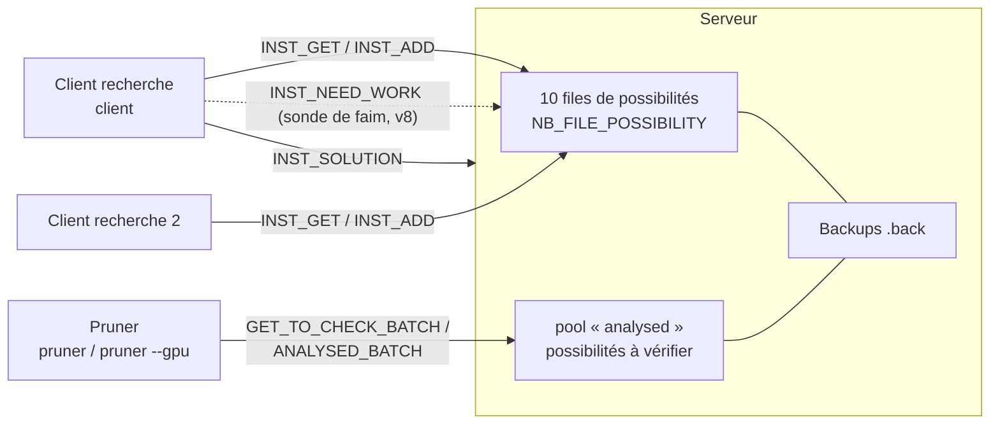
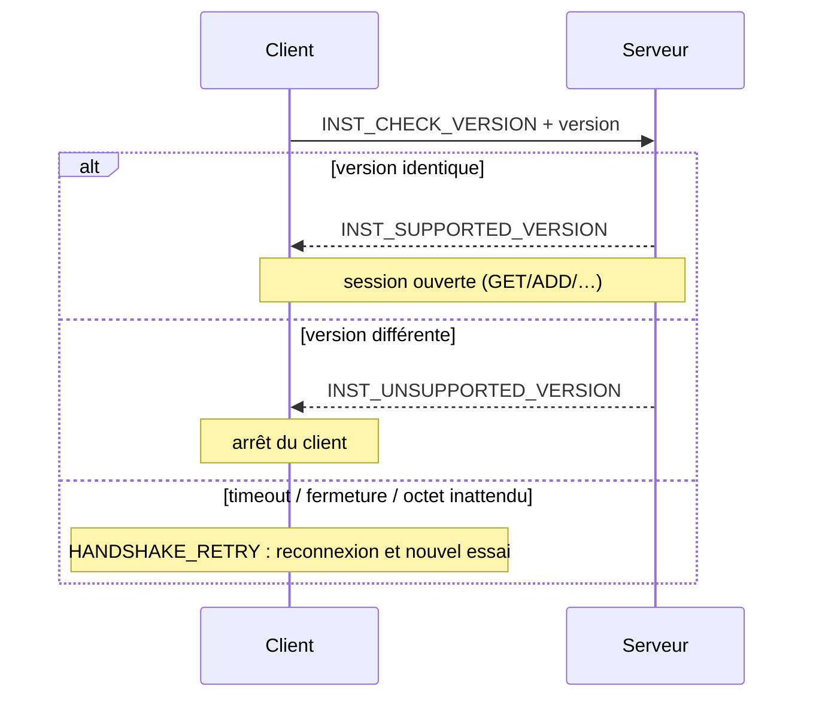
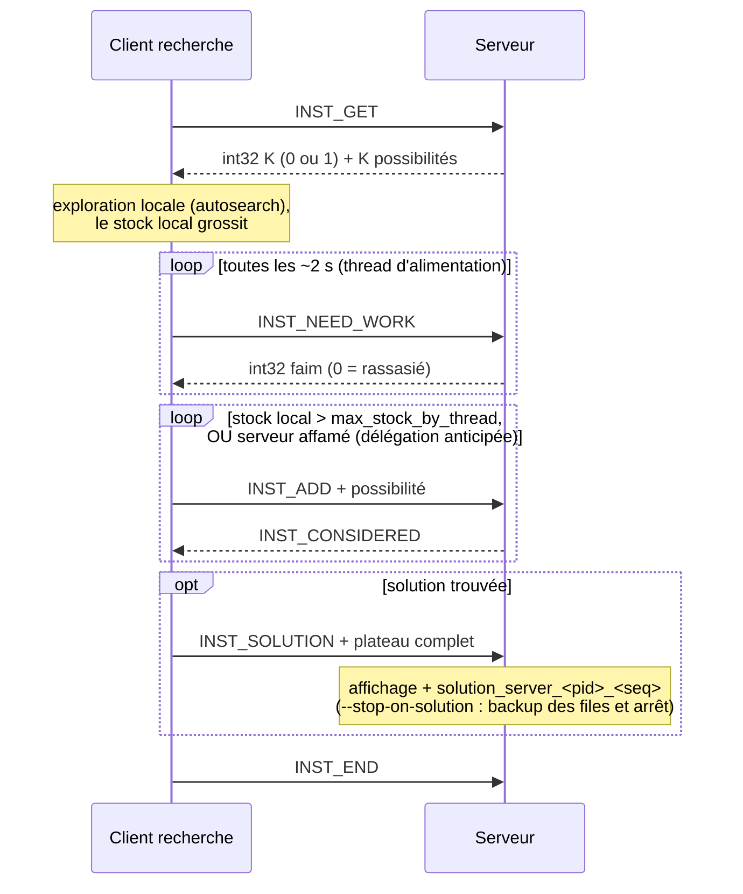
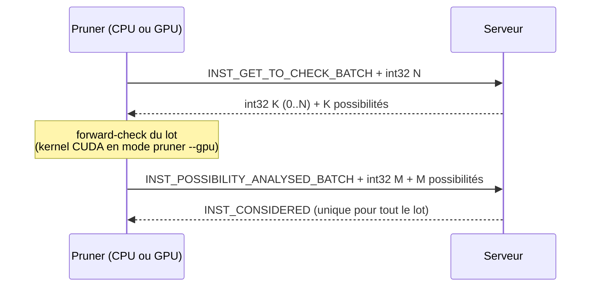
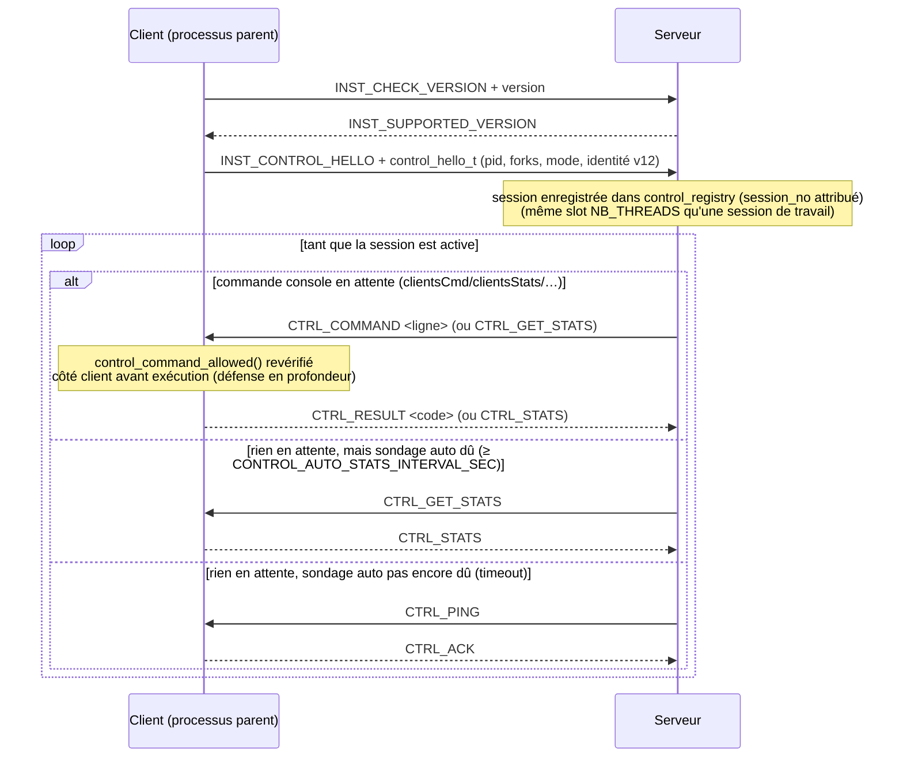
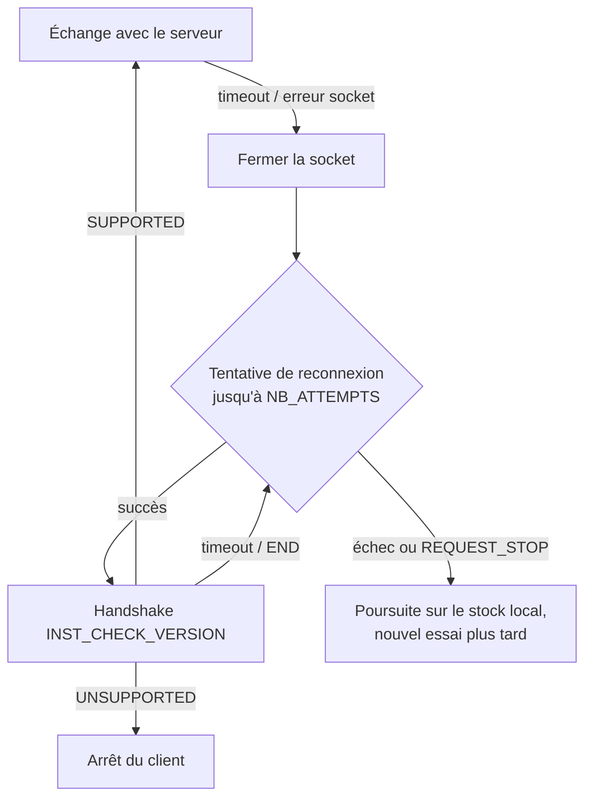

# Échanges client / serveur

Ce document décrit le protocole TCP qui relie le serveur (`server`) aux différents
clients (`client`, `pruner`, `pruner --gpu`) : les instructions échangées, la gestion
de charge, les séquences de communication typiques et le comportement en cas de panne.
Il couvre aussi (depuis la v9) le [canal de contrôle](#canal-de-contrôle-v9), une
connexion TCP séparée où le **serveur** devient l'initiateur pour piloter un client à
distance (statistiques, pause/reprise, …).

Le code correspondant vit principalement dans :

- [src/net/etii_protocol.h](../src/net/etii_protocol.h) / [etii_protocol.c](../src/net/etii_protocol.c) — instructions du protocole de travail, `send_all`/`recv_all`, handshake ;
- [src/net/client.c](../src/net/client.c) / [server.c](../src/net/server.c) — sockets et timeouts ;
- [src/core/datamanager.c](../src/core/datamanager.c) — files de possibilités côté serveur et échanges côté client ;
- [src/app/etii_server.c](../src/app/etii_server.c) / [etii_client.c](../src/app/etii_client.c) — boucles de traitement du protocole de travail ;
- [src/net/control_protocol.h](../src/net/control_protocol.h) / [src/app/etii_control.c](../src/app/etii_control.c) / [src/app/control_registry.c](../src/app/control_registry.c) — canal de contrôle (v9), détaillé plus bas.

## Vue d'ensemble

Le serveur détient le stock global de **possibilités** (états de plateau partiels,
`struct possibility_packet`). Les clients de recherche en retirent (`INST_GET`), les
explorent localement, et redéposent l'excédent (`INST_ADD`). Les pruners retirent des
possibilités *non vérifiées* par lots, les valident (forward-check), puis signalent
celles à éliminer.



Chaque échange est un `packet` de taille fixe : un octet d'`instruction` suivi, selon
l'instruction, d'un `possibility_packet` (~520 octets). Depuis la version 7 du
protocole, **tous** les transferts de paquets passent par `send_all`/`recv_all`, qui
réassemblent les envois TCP partiels (voir [Robustesse](#comportement-en-cas-de-problème)).

## Types d'instructions

| Constante | Valeur | Sens | Rôle |
|---|---|---|---|
| `INST_ADD` | 1 | client → serveur | Dépose une possibilité (réponse : `INST_CONSIDERED`) |
| `INST_GET` | 2 | client → serveur | Demande une possibilité ; réponse : `int32` K + K paquets (K ∈ {0, 1}) |
| `INST_SOLUTION` | 3 | client → serveur | Envoie un plateau complet ; le serveur l'affiche et le sauvegarde |
| `INST_END` | 4 | bidirectionnel | Fin de session (aussi valeur de repli sur timeout de `recv_instruction`) |
| `INST_CONSIDERED` | 5 | serveur → client | Accusé de réception |
| `INST_NULL` | 6 | — | Hérité : plus émis depuis v7 (le compteur `int32` des réponses GET le remplace) |
| `INST_POSSIBILITY_ANALYSED` | 7 | pruner → serveur | Une possibilité vérifiée (unitaire) |
| `INST_TEST_CONNECTED` | 8 | client → serveur | Keepalive : le serveur renvoie la même instruction |
| `INST_CHECK_VERSION` | 9 | client → serveur | Ouverture du handshake de version |
| `INST_SUPPORTED_VERSION` | 10 | serveur → client | Version acceptée |
| `INST_UNSUPPORTED_VERSION` | 11 | serveur → client | Version refusée : le client s'arrête |
| `INST_GET_TO_CHECK` | 12 | pruner → serveur | Demande une possibilité non vérifiée (réponse : `int32` K + K paquets) |
| `INST_GET_TO_CHECK_BATCH` | 13 | pruner → serveur | Demande jusqu'à N possibilités en un aller-retour (`int32` N → `int32` K + K paquets) |
| `INST_POSSIBILITY_ANALYSED_BATCH` | 14 | pruner → serveur | Signale M possibilités analysées (`int32` M + M paquets → un seul `INST_CONSIDERED`) |
| `INST_NEED_WORK` | 15 | client → serveur | Sonde de faim (v8) : réponse `int32` N = nombre de possibilités que le serveur souhaiterait recevoir (0 = stock suffisant). Tient lieu de keepalive et pilote la [délégation anticipée](#gestion-de-charge) |
| `INST_CONTROL_HELLO` | 16 | client → serveur | Annonce (v9) : le processus **parent** du client (jamais un fork) ouvre une connexion TCP dédiée et bascule cette session en [canal de contrôle](#canal-de-contrôle-v9), où les rôles s'inversent |
| `INST_CLIENT_HELLO` | 17 | client → serveur | Annonce d'identité (v12) sur la connexion de TRAVAIL : chaque fork l'envoie UNE FOIS, juste après le handshake de version, avant sa première instruction (`INST_GET`/`INST_ADD`/…) — `int32` de longueur puis un `client_identity_t` cadré (`net/client_identity.h` : `machine_uid`, `client_uid`, `fork_seq`, `mode`, `label`), même convention que `INST_CONTROL_HELLO`. Best-effort côté serveur : une longueur hors borne désynchronise le flux (fermeture), mais un contenu qui ne décode pas se contente de journaliser une erreur — un champ d'affichage cosmétique ne doit jamais faire tomber une connexion de travail |

Toute évolution du format « fil » impose d'incrémenter `VERSION` : le handshake exige
une correspondance exacte. La v11 a bumpé ainsi `VERSION` sans ajouter de nouvelle
instruction : le nouveau parcours de plateau (`directions[]`/`dirx[]`/`diry[]`,
`src/core/core_static_variables.c`, pensé pour éliminer des possibilités plus tôt dans la
recherche) fait qu'un même indice de curseur (`alloc`) désigne une case différente
qu'en v10 — un `possibility_packet` échangé entre versions désynchroniserait
silencieusement le board plutôt que de planter, d'où le refus explicite au handshake.
La v12 bump `VERSION` pour `INST_CLIENT_HELLO` ci-dessus : un serveur v11 la
traiterait comme une instruction inconnue et fermerait la connexion, d'où le refus
explicite au handshake plutôt qu'un désync silencieux.
La v13 change le SENS de `possibility_packet.alloc`, sans toucher son type ni sa
position sur le fil (voir [docs/conception/mrv_moteur_unique.md](conception/mrv_moteur_unique.md)) :
avant v13, `alloc` était un curseur de position dans `directions[]`/`dirx[]`/`diry[]`
(« prochaine case à traiter ») ; depuis v13, c'est le nombre de cases non vides de la
grille (`possibility_placed_count`). Un client v12 et un serveur v13 (ou l'inverse) se
comprendraient sur le fil tout en désynchronisant silencieusement l'état du plateau —
même raisonnement que pour la v11, d'où le refus explicite au handshake.
Le champ `min_candidats` (score MRV, seconde coordonnée de `alloc` — voir
[docs/autosearch_step.md](autosearch_step.md)) n'a en revanche PAS bumpé
`VERSION` : il loge dans le bourrage d'alignement de `possibility_packet`
(`sizeof` inchangé, 576 octets), et toute donnée fraîchement produite par le
moteur MRV l'écrit correctement par construction — seul un fichier `.back`
écrit avant son introduction en porte une valeur non fiable, traitée hors
protocole (recomptage impossible, écrasée par la sentinelle « inconnu » au
chargement, cf. `import`/`import_analysed`/`stock_spill_reload` dans
`core/datamanager.c`/`core/stock_spill.c`).

### Handshake de version

À la connexion, le client envoie `INST_CHECK_VERSION` suivi de son numéro de version.



Point important : un `INST_END` reçu ici peut être un simple timeout de
`recv_instruction`, pas un refus — il est donc classé `HANDSHAKE_RETRY`, jamais
« version refusée ».

## Cycle de vie d'un client de recherche



## Cycle de vie d'un pruner (échanges par lots)



Le lot est borné par `pruner_batch_size` (4ᵉ argument CLI ou commande console
`prunerBatch <n>`, plafonné à `PRUNER_BATCH_MAX`), ce qui borne la mémoire du pruner
et divise le nombre d'allers-retours réseau par rapport au mode unitaire
(`INST_GET_TO_CHECK` / `INST_POSSIBILITY_ANALYSED`, conservé pour compatibilité).

## Canal de contrôle (v9, étendu en v10 et v12)

Au-dessus du protocole de travail décrit ci-dessus (toujours initié par le client :
GET/ADD/ANALYSED/…), une **seconde connexion TCP indépendante par processus client**
permet au **serveur** de piloter un client en cours d'exécution — demander ses
statistiques en direct, ou lui pousser une commande console (`pause`, `resume`,
`limit`, …) — sans jamais toucher aux threads de recherche.

Le code correspondant vit dans :

- [src/net/control_protocol.h](../src/net/control_protocol.h) / [control_protocol.c](../src/net/control_protocol.c) — codec des trames `CTRL_*`, structures `control_hello_t`/`control_stats_t`, liste blanche `control_command_allowed` ;
- [src/app/control_registry.h](../src/app/control_registry.h) / [control_registry.c](../src/app/control_registry.c) — registre serveur des sessions de contrôle actives ;
- [src/app/etii_control.h](../src/app/etii_control.h) / [etii_control.c](../src/app/etii_control.c) — thread client (processus **parent** uniquement) ;
- [src/app/etii_server.c](../src/app/etii_server.c) (`run_control_session`/`control_session_step`) — boucle serveur du canal ;
- [src/core/best_board.h](../src/core/best_board.h) / [best_board.c](../src/core/best_board.c) — mémorisation « premier à dépasser gagne » de la représentation du meilleur plateau, aux trois échelles fork/parent/serveur (v10).

### Qui l'ouvre, et pourquoi ça ne coûte rien à la recherche

Seul le processus **parent** du client (celui qui fork les threads de recherche,
jamais un fork lui-même) ouvre cette connexion — une par *processus* client, pas par
fork. Elle tourne sur son propre thread détaché (`run_control_channel`), entièrement
séparé des threads de recherche, du thread d'alimentation du protocole de travail et
des threads de statistiques/console. La seule chose que paie la boucle chaude de
recherche est la lecture (déjà existante) de la globale `request` à chaque nœud — rien
n'a été ajouté à cette boucle pour le canal de contrôle en tant que tel.

### Inversion des rôles

Après le handshake de version habituel, le client envoie `INST_CONTROL_HELLO` (pid,
nombre de forks, et depuis v12 une identité déclarée — `machine_uid`, `client_uid`,
`mode`, `label`, avec `fork_seq` fixé à `-1` puisque ce hello représente le process
parent dans son ensemble — `control_hello_t`) puis les rôles s'inversent : c'est
désormais le **serveur** qui prend l'initiative des échanges sur cette connexion.
Côté serveur, `control_registry_register` attribue en plus un `session_no` : un
compteur monotone jamais réutilisé, même quand l'INDICE de slot du registre l'est
après une déconnexion — c'est ce `session_no`, plus le libellé et les nonces
hexadécimaux, que la commande console `clients` et `GET /api/v1/clients` exposent
en plus des champs déjà existants.



### Format de trame

Un codec autonome, volontairement distinct de `packet`/`possibility_packet` (qui ne
transporte qu'un seul type de charge utile, et dont le struct `packed` garde du
padding caché — ne jamais le poser sur le fil sans passer par des champs explicites).
Chaque trame est `uint8_t cmd` + `int32_t len` + `len` octets de payload, toujours via
`send_all`/`recv_all` — jamais un `send`/`recv` brut, pour la même raison que le
protocole de travail. Une longueur hors borne (`< 0` ou `> CTRL_PAYLOAD_MAX` = 4000)
est rejetée sans tentative d'allocation.

| Commande `CTRL_*` | Valeur | Sens |
|---|---|---|
| `CTRL_PING` / `CTRL_ACK` | 1 / 2 | Keepalive émis par le serveur quand aucune commande n'est en attente |
| `CTRL_GET_STATS` / `CTRL_STATS` | 3 / 4 | Demande de statistiques agrégées ; réponse `control_stats_t` (coups/s, stock, analysé, `max_result`, pruner vérifiées/éliminées, cases prunées/s). Émis soit sur demande explicite (`clientsStats`/`POST /api/v1/clients/stats`), soit automatiquement au plus toutes les `CONTROL_AUTO_STATS_INTERVAL_SEC` (30 s) — voir ci-dessous |
| `CTRL_COMMAND` / `CTRL_RESULT` | 5 / 6 | Commande console poussée en texte ; réponse = code retour `int32` de `do_command_line()` |
| `CTRL_GET_BEST_BOARD` / `CTRL_BEST_BOARD` | 7 / 8 | *(v10)* Demande la représentation complète du meilleur plateau connu du client (agrégat de ses forks) ; réponse = `uint8_t valid` puis, si `valid`, `sizeof(struct possibility_packet)` octets bruts (même convention que le protocole de travail GET/ADD : struct copié tel quel, round-trip valide sur le même build) |

### Sondage automatique des statistiques

Avant cette fonctionnalité, `control_session_step` (`src/app/etii_server.c`) n'émettait
`CTRL_GET_STATS` qu'en réponse à une commande explicitement postée (`clientsStats`
console, ou `POST /api/v1/clients/stats` de l'API HTTP) — en son absence, la branche
timeout n'envoyait que des `CTRL_PING`/`CTRL_ACK`. Or c'est justement la **réception**
d'un `CTRL_STATS` qui déclenche le tirage du meilleur plateau
(`CTRL_GET_BEST_BOARD`, cf. plus bas) quand `max_result` dépasse le record déjà connu
du serveur : sans sondage périodique, un nouveau record côté client pouvait rester
invisible côté serveur indéfiniment, jusqu'à ce qu'un opérateur pense à lancer
`clientsStats` manuellement — potentiellement plusieurs minutes après son apparition.

`control_registry_auto_stats_due(session_index, CONTROL_AUTO_STATS_INTERVAL_SEC)`
(`src/app/control_registry.c`, intervalle 30 s défini dans `app_static_variables.h`) est
maintenant vérifié en premier dans la branche timeout : si dû, un aller-retour
`CTRL_GET_STATS`/`CTRL_STATS` (factorisé dans `control_session_poll_stats`, partagé
avec le chemin de commande explicite) remplace le `CTRL_PING` de ce tour — un nouveau
record se propage donc en au plus un intervalle, sans action opérateur. La marque
« dernière tentative » est posée sous le mutex de la session, indépendamment de
`stats_time` (qui ne bouge que sur un décodage réussi), pour qu'un échec transitoire ne
déclenche pas une nouvelle tentative au tour suivant.

### Meilleur plateau connu (`CTRL_GET_BEST_BOARD`/`CTRL_BEST_BOARD`, v10)

Les statistiques (`max_result`/`control_stats_t.max_result`) n'exposent que le
**nombre** de pièces placées au record — jamais l'agencement qui l'a produit, qui
continue d'être muté par le backtracking immédiatement après. `core/best_board.h`
comble ce manque avec une primitive « on ne garde que la première représentation qui
dépasse strictement le record déjà connu », réutilisée à trois échelles :

1. **Fork de recherche** (`g_search_best_board`) : mise à jour directement dans la
   boucle chaude (`etii_search.c`), en même temps que `max_result`.
2. **Processus parent client** (`g_client_aggregate_best_board`) : un fork qui bat
   son propre record envoie sa représentation au parent par IPC
   (`IPC_MSG_BEST_BOARD`, `src/net/ipc_protocol.h`) — jamais à chaque tour, seulement
   sur record, contrairement à `IPC_MSG_STATS`.
3. **Serveur** (`g_server_best_board`) : dans `control_session_step`
   (`src/app/etii_server.c`), juste après avoir décodé un `CTRL_STATS`, si le
   `max_result` rapporté dépasse le meilleur déjà connu du serveur, celui-ci envoie
   immédiatement `CTRL_GET_BEST_BOARD` **sur la même connexion** et attend
   `CTRL_BEST_BOARD` avant de rendre la main — c'est le serveur qui demande,
   uniquement quand il en a besoin, jamais le client qui pousse spontanément.

Le serveur applique la même règle « premier à dépasser gagne » à sa propre agrégation
(`best_board_try_record`), qu'il persiste avec le reste du stock (autobackup,
`eternityII-best_board.back`/`temp-best_board.back`) et expose via
[`GET /api/v1/best-board`](api_http_rest.md).

### Resynchronisation du `max_result` global du serveur sur `CTRL_STATS`

Avant tout correctif, le serveur exposait **trois** indicateurs de « meilleur résultat »
mis à jour par des chemins indépendants, sans jamais se recopier entre eux : le global
`max_result` (logs serveur, `GET /api/v1/stats`), alimenté **uniquement** par le
protocole de travail classique (`INST_ADD`/…, quand un client pousse effectivement ses
possibilités) ; le cache par-session (`control_registry_record_stats`, `GET
/api/v1/clients`), alimenté à chaque `CTRL_STATS` ; et `g_server_best_board` (`GET
/api/v1/best-board`), alimenté seulement sur un `CTRL_STATS` qui bat le record déjà
connu. Un client qui annonçait son record uniquement via le canal de contrôle (sans
transfert `INST_ADD` correspondant) faisait donc progresser les deux derniers sans que
le premier — celui affiché en logs serveur et par `/api/v1/stats` — ne bouge.
`control_session_step` (`src/app/etii_server.c`) met désormais aussi à jour le global
`max_result` dès qu'un `CTRL_STATS` rapporte une valeur strictement supérieure, en plus
du cache par-session et de `g_server_best_board` — les trois vues restent cohérentes
entre elles. Verrouillé par
`control_session_step_get_stats_updates_global_max_result`
(`tests/app/test_etii_server.c`).

### Double vérification de la liste blanche

Seules quelques commandes console sont déclenchables à distance
(`control_command_allowed`) : `pause`, `resume`, `limit`, `maxStockByThread`,
`prunerBatch`, `clientsCommand` (alias `clientsCmd`), `clientsRoles`, `clientsWork`, `start`,
`stopForks`, `configApply`, `config`, `configSave` — jamais `exit`,
`restore`, `import`, ni rien de destructeur. Cette vérification est faite **deux fois
indépendamment** : côté serveur dans l'interpréteur de `clientsCmd` (qui refuse même
de diffuser une ligne interdite), et, en défense en profondeur, côté client dans
`control_channel_handle_frame` avant tout appel à `do_command_line` — le client ne
fait jamais confiance à ce qui arrive sur ce socket au seul motif que ça y arrive.

**`clientsCommand`/`clientsCmd`, `clientsRoles` et `clientsWork` sont des commandes SERVEUR** (elles
agissent sur `control_registry`, jamais sur les forks de recherche d'un client) —
les admettre dans cette même liste blanche est ce qui les rend exécutables via
l'[API HTTP admin](api_http_rest.md#post-apiv1command) (`POST /api/v1/command` ->
`admin_apply_remote_command`), exactement comme `pause`/`limit`/… **Sur cette API
HTTP précisément**, `clientsCommand`/`clientsCmd` (une commande de modification :
elle pousse `CTRL_COMMAND` à un client) exige un jeton Bearer valide — seule
`clientsWork` (pure lecture, `control_command_read_only`) en est dispensée, voir
[Authentification](api_http_rest.md#authentification). Cette distinction
lecture/écriture n'existe QUE pour l'API HTTP : ni la console ni le canal de
contrôle n'ont de notion de jeton. Les admettre côté canal de contrôle (`CTRL_COMMAND`,
poussé par le serveur vers un client) est inoffensif par construction : sur un
client, `control_registry` est toujours vide (rempli uniquement côté serveur par
`INST_CONTROL_HELLO`), donc leur exécution y est un no-op silencieux — même
raisonnement déjà appliqué à `pause`/`resume` plus haut.

**`restore`/`backup` restent hors de portée de ce canal, quoi qu'il arrive.**
`control_command_privileged` (`src/net/control_protocol.c` — comme
`control_command_allowed`/`control_command_read_only`, une simple projection de
`control_command_classify`, la source unique de vérité qui distingue explicitement
« relayable vers un client » de « lecture vs écriture ») liste ces deux commandes
séparément de `control_command_allowed`, et **seule** l'[API HTTP admin](api_http_rest.md#authentification)
(`POST /api/v1/command`, après authentification par jeton Bearer via
`--http-token-file`) les consulte — jamais `control_channel_handle_frame` ni
`clientsCmd`. Élargir l'accès de l'API HTTP à ces deux commandes ne les rend donc
**pas** déclenchables à distance sur un client par ce canal : les deux vérifications
ci-dessus restent strictement bornées à la même liste `control_command_allowed`
qu'avant.

### Pilotage à distance du cycle de vie des fils

`start`, `stopForks`, `configApply`, `config` (sans argument ou `config <clé>
<valeur>`) et `configSave` rejoignent `control_command_allowed` pour être
poussables par le serveur vers un client, exactement comme `pause`/`limit`/…
(voir [la console interactive](console.md#général) pour la sémantique de
chacune côté console). Deux points à retenir, propres à ces cinq commandes :

- **Elles n'ont de sens que sur un CLIENT.** Comme sur la console
  (`command_is_client_only`, `src/ui/command_lines.c`), elles agissent sur
  `fork_orchestrator`/`client_config` — inexistants côté rôle serveur
  (`fork_orchestrator_run` n'est jamais appelée par `handle_server`). Poussées
  via `clientsCommand`/`clientsCmd` (canal de contrôle), elles n'atteignent de
  toute façon jamais qu'un client (`control_registry` ne contient QUE des
  sessions client, jamais le serveur lui-même) : pas de risque côté binaire.
  Sur `POST /api/v1/command` en revanche, la commande serait exécutée
  directement sur le processus qui héberge l'API HTTP — TOUJOURS le serveur
  (`--http-port` est une option serveur uniquement) — donc
  `admin_apply_remote_command` les refuse explicitement (`403`) dès que
  `server == 1`, plutôt que de laisser `configApply` reconstruire les
  tableaux de fils/la map de recherche du SERVEUR par erreur (voir
  [l'API HTTP admin](api_http_rest.md#post-apiv1command) pour la manière
  correcte de les déclencher à distance : `clientsCommand --to <cible>
  <commande>`).
- **`config`/`configSave` restent, elles, masquées côté SERVEUR sur sa PROPRE
  console** (`command_is_client_only`) et ne figurent dans
  `control_command_allowed` que pour être poussées vers un CLIENT — un
  `clientsCmd config` depuis un serveur n'a jamais de sens sur le serveur lui-
  même, pour la raison ci-dessus.

Exemple : reconfigurer `nb_forks` d'un client `jetson-1` déjà en cours
d'exécution, sans jamais couper sa console ni sa connexion :

```
clientsCommand --to jetson-1 config nb_forks 8
clientsCommand --to jetson-1 configApply
```

### Adressage des commandes (`--to`)

Avant cette fonctionnalité (PR3), `clientsCmd` ne savait que **diffuser** :
impossible de piloter un seul client d'un parc sans agir sur tous les autres en
même temps. `clientsCommand [--to <cible>]
<ligne>` (`clients_cmd_interpreter`, `src/ui/command_lines.c`) ajoute un ciblage
optionnel — la diffusion reste le comportement par défaut sans `--to`.

`<cible>` est essayée, dans cet ordre, par `control_registry_send_command_to`
(`src/app/control_registry.c`) :

1. un `session_no` décimal (identifiant de session, voir la commande `clients`) ;
2. un `client_uid` hexadécimal (longueur exacte, voir `GET /api/v1/clients`) ;
3. un `label` déclaré (`--name`, égalité exacte de chaîne).

**`session_no` n'est pas un slot.** Le registre est indexé par un tableau de slots
recyclés (`MAX_CONTROL_SESSIONS`), mais `session_no` (compteur monotone attribué une
fois pour toutes à l'enregistrement, jamais réutilisé même quand le slot l'est) et
`client_uid` (nonce 128 bits tiré au démarrage du processus parent, jamais réutilisé
par construction) sont tous deux des identifiants **jamais réattribués** à un
titulaire différent. Résoudre une cible par l'un de ces deux champs ne peut donc
jamais frapper le mauvais client :
soit la session visée existe encore sous cette même identité, soit elle a disparu
et la commande est **refusée** comme cible inconnue/déconnectée — jamais
silencieusement redirigée vers le nouvel occupant du même slot. `label` n'étant
**pas** garanti unique (deux clients peuvent partager le même `--name`), une cible
qui correspond à plusieurs sessions actives est refusée comme **ambiguë** plutôt que
d'en choisir une arbitrairement.

Le ciblage passe par **exactement** la même vérification `control_command_allowed`
que la diffusion, appliquée **avant** toute résolution de cible : `clientsCommand
--to <session_no> exit` est refusé exactement comme `clientsCommand exit` — cibler
une session n'élargit jamais le jeu de commandes autorisées à distance.

```
clients                                    # liste les sessions, avec leur session_no
clientsCommand --to 3 pause                # cible la session #3 uniquement
clientsCommand --to jetson-1 limit 500     # cible par label déclaré
clientsCommand limit 500                   # sans --to : diffusion (comportement historique)
```

Le même ciblage est disponible via l'[API HTTP admin](api_http_rest.md#post-apiv1command)
(`POST /api/v1/command {"command":"clientsCommand --to jetson-1 limit 500"}`,
avec un en-tête `Authorization: Bearer <jeton>` — `clientsCommand` est une commande de
MODIFICATION sur cette API, voir [Authentification](api_http_rest.md#authentification)),
appliqué par la portion réentrante (`strtok_r`) dédiée d'`admin_apply_remote_command`
(`src/ui/command_lines.c`) — jamais par `clients_cmd_interpreter` lui-même, qui
tokenise via le curseur global `strtok` et corromprait un appel HTTP concurrent à une
saisie console ou à une trame du canal de contrôle en cours de découpage. Une cible
inconnue/déconnectée/ambiguë y répond `400` (argument invalide), pas `403`/`401` : la
commande elle-même reste whitelistée (et authentifiée, si un jeton valide a été fourni).

### Dosage recherche/contrôle par fork, piloté à distance (`clientsRoles`)

Le pilotage de base du dosage `pruner_forks` d'un client (option CLI
`--pruner-forks`, clé de configuration `pruner_forks`, voir
[docs/utilisation.md](utilisation.md#dosage-recherchecontrôle-par-fork---pruner-forks))
**fonctionnait déjà** dès l'adressage des commandes ci-dessus, sans une ligne
de plus :

```
clientsCommand --to jetson-1 config pruner_forks 2
clientsCommand --to jetson-1 configApply
```

`clientsRoles [--to <cible>] <nb_pruner>` (`clients_roles_interpreter`,
`src/ui/command_lines.c`) compose ces deux commandes en une seule — même
résolution de cible que `clientsCommand --to` (`session_no`, `client_uid`,
`label`, dans cet ordre), même comportement de diffusion par défaut sans
`--to`. `clientsRoles` rejoint `control_command_allowed` exactement comme
`clientsCommand`/`clientsCmd` (un seul point à toucher,
`control_command_classify`) — accessible à distance (console, `POST
/api/v1/command` avec jeton Bearer si `--http-token-file` est configuré) selon
les mêmes règles.

```
clientsRoles --to jetson-1 2   # 2 forks de jetson-1 passent au contrôle
clientsRoles 0                 # tous les clients connectés repassent en recherche pure
```

**Dosage désiré, persistant par machine.** `control_registry_apply_role_dosage`
(`src/app/control_registry.c`) ne se contente pas de composer les deux
commandes : pour chaque session effectivement touchée, elle mémorise
`pruner_forks` dans une table interne keyée par **`machine_uid`** — jamais
`client_uid` ni `session_no`, qui ne survivent pas à un redémarrage de
processus client (`client_uid` est un nonce de SESSION, régénéré à chaque
lancement, cf. [Trois notions distinctes](utilisation.md#mode-client)).
`control_registry_register` consulte cette table à chaque nouvel
enregistrement et, si la machine qui se (re)connecte a un dosage désiré
mémorisé, pré-poste `"config pruner_forks <n>"` puis `"configApply"` dans sa
file toute neuve, avant même son premier `CTRL_PING` — **même mécanisme** que
`g_desired_pause_state` pour `pause`/`resume` (voir plus haut), simplement
keyé par machine plutôt que global (le dosage est par construction une
propriété PAR CLIENT, contrairement à la pause qui s'applique à tout le
parc). Les deux mécanismes coexistent sans conflit dans la même file :
une session qui se reconnecte pendant une pause désirée ET porteuse d'un
dosage désiré reçoit les trois commandes (`pause`, `config pruner_forks <n>`,
`configApply`), dans cet ordre.

Une machine jamais touchée par `clientsRoles` n'a pas de dosage désiré
mémorisé : elle garde le comportement par défaut (rôle par fork impliqué par
le mode de lancement, `client` ou `pruner`). Ce dosage désiré est
**volatile** (perdu au redémarrage du SERVEUR, contrairement au [registre de
clients connus](#registre-de-clients-connus) qui persiste sur disque) — un
redémarrage du serveur retombe donc sur le dosage par défaut de chaque client
tant que l'opérateur ne rejoue pas `clientsRoles`.

**Client GPU exclu du dosage dynamique.** `clientsRoles`/`--auto-roles`
composent aveuglément `config pruner_forks <n>` + `configApply` — le serveur
n'a aucune notion du contexte CUDA d'un client distant. Sans garde-fou côté
client, un client lancé en `pruner --gpu` recevant ces deux commandes (ciblé
explicitement, ou touché par une diffusion sans `--to`, ou par une politique
`--auto-roles` qui ignore aussi le mode GPU) re-forkerait silencieusement
avec un `pruner_forks` différent de `nb_forks` : exactement l'état que le
garde-fou de démarrage (`gpu_pruner_forks_conflict`, `src/app/app_runtime.{h,c}`)
rend impossible au lancement, puisque le contexte CUDA n'est initialisé
qu'une seule fois par process et ne consulte pas le rôle par fork. C'est donc
le CLIENT qui referme ce trou : `config_apply_interpreter`
(`src/ui/command_lines.c`) réévalue l'invariant sur la configuration EN
PRÉPARATION juste avant de poster `EV_RESTART`
(`fork_orchestrator_staged_gpu_pruner_conflict`,
`src/app/fork_orchestrator.{h,c}`) et refuse (`log_error`, aucun re-fork,
`configApply` répond `ADMIN_CMD_BAD_ARGS` sur ce chemin) toute application qui
rendrait `pruner_forks` incohérent avec `nb_forks` — que la clé stagée en
cause soit `pruner_forks` lui-même ou `nb_forks` seul (un redimensionnement
qui laisse l'ancien `pruner_forks_requested` incohérent viole l'invariant
tout autant). Un client GPU reste donc, par construction, exclu de tout
pilotage dynamique du dosage — `clientsRoles`/`--auto-roles` n'ont aucun
effet sur lui au-delà du refus journalisé.

### Politique automatique de dosage recherche/contrôle

`--auto-roles` (serveur uniquement, désactivée par défaut — voir
[docs/utilisation.md](utilisation.md#politique-automatique-de-dosage---auto-roles))
fait jouer au serveur, PAR LUI-MÊME, le rôle que `clientsRoles` (ci-dessus)
laisse à l'opérateur : ajuster `pruner_forks` diffusé au parc en
fonction du besoin mesuré. Branchée dans le tour existant de 10 s de
`check_server_step` (`src/app/etii_server.c`) — aucune cadence dédiée.

**Décision pure.** `compute_desired_role_mix` (`src/app/etii_server.h`), sur
le modèle exact de `compute_server_hunger`, prend en entrée :

- les deux tailles de stock déjà calculées par ce même tour
  (`Σ file_size(f)` non vérifié, `Σ file_checked_size(f)` vérifié) ;
- le ratio `datamanager_resident_packets() / datamanager_ram_limit_packets()`
  comparé à `STOCK_SPILL_HIGH_PERCENT` (0 sans `--stock-max-ram`, pas de
  notion de pression sans plafond) ;
- le delta, depuis le tour précédent, des compteurs de famine par rôle
  `server_search_starved`/`server_prune_starved` (ces compteurs sont
  CUMULATIFS depuis le démarrage du serveur, jamais remis à zéro : c'est
  l'appelant qui calcule le delta) ;
- le nombre de forks par rôle, pondéré par `nb_forks` et non par un simple
  compte de sessions (`control_registry_count_role_forks` — voir
  encadré ci-dessous).

> **Correctif** : la première version utilisait `control_registry_count_roles`
> (un compte de SESSIONS — une par processus parent connecté). Avec une
> seule machine cliente connectée, ce compte vaut toujours au plus 1, quel
> que soit son nombre réel de forks — le garde-fou « jamais 0 chercheur »
> (§4 ci-dessous) se déclenchait donc à TORT dès qu'une seule machine était
> connectée, bloquant indéfiniment toute augmentation de `pruner_forks` même
> avec des dizaines de forks de recherche et un stock non vérifié en
> croissance continue (bug réel observé en usage, déploiement à une seule
> machine cliente — le cas le plus courant). `control_registry_count_role_forks`
> somme `nb_forks` par rôle au lieu de compter les sessions : une seule
> machine à 8 forks compte désormais comme 8, pas comme 1.

Elle renvoie un **sens** d'ajustement (`ROLE_MIX_DECREASE_PRUNE` /
`ROLE_MIX_KEEP` / `ROLE_MIX_INCREASE_PRUNE`), jamais une cible absolue —
priorité, du plus urgent au plus indicatif :

1. Parc déjà à 0 chercheur avec au moins un pruner : violation de
   l'invariant, corrigée en priorité sur tout le reste.
2. Parc vide : rien à décider.
3. Famine (chercheur OU pruner) : la recherche étant le seul rôle qui
   régénère du stock à partir de rien, réduire le dosage est la correction
   sûre dans les deux cas.
4. Garde-fou « jamais 0 chercheur / jamais 100 % pruner » : tant qu'il ne
   reste qu'un chercheur (ou zéro), jamais d'augmentation.
5. Pression RAM haute : plus de vérification aide à éliminer les
   possibilités mortes plus vite.
6. Ratio de backlog non-vérifié/vérifié : un excès marqué de non-vérifié
   signale trop peu de pruners (le problème initial de ce document — jusqu'à
   50 % de stock mort distribué sans pruner) ; l'excès inverse signale trop
   de pruners.

**Pilotage impur, avec hystérésis.** `check_server_step` tient un état
explicite d'un tour à l'autre (`auto_role_mix_state_t` — un paramètre
explicite, pas une statique cachée, pour rester testable indépendamment de
l'ordre d'exécution des tests) : le dernier dosage effectivement diffusé
(`current_dosage`, démarre à 0 — comportement par défaut) et le nombre de
tours écoulés depuis le dernier changement appliqué. Un changement de sens
n'est traduit en action que si ce délai minimal
(`ROLE_MIX_MIN_TICKS_DEFAULT`, 12 tours ≈ 2 minutes) est écoulé, et le
dosage n'évolue alors que par pas de ±1 (jamais un saut direct) — chaque
changement effectif coûte un `stopForks` + re-fork chez CHAQUE client visé,
le même coût qu'un `clientsRoles` manuel. La diffusion elle-même
réutilise `control_registry_apply_role_dosage(NULL, n)` (broadcast à
tout le parc) : une décision automatique et une décision manuelle
(`clientsRoles`) partagent donc le même dosage désiré persistant par
machine — l'automatique peut remplacer un dosage manuel à son prochain tour
si les signaux le justifient, et réciproquement.

Seuils choisis comme point de départ raisonnable, documentés comme tels dans
le code — à remesurer une fois `--auto-roles` exercé en conditions réelles
(même esprit que [elagage_recherche.md](conception/elagage_recherche.md)
§4.7) : `ROLE_MIX_BACKLOG_FLOOR` (8, plancher de bruit sous lequel un
déséquilibre de stock est ignoré) et `ROLE_MIX_MAX_DOSAGE` (8, plafond
défensif de dernier recours sur le dosage atteint par la seule politique
automatique, sans effet tant qu'un déséquilibre ne persiste pas des dizaines
de tours d'affilée).

### Registre de clients connus

PR4 ajoute un **second** registre serveur, `known_clients_registry.{h,c}`
(`src/app/`), volontairement **indépendant** de `control_registry` décrit
ci-dessus — les deux ne se recouvrent pas :

| | `control_registry` | Registre de clients connus |
|---|---|---|
| Indexé par | slot de session (réutilisé) | `machine_uid` (clé de cumul) |
| Durée de vie | la session TCP | la vie du serveur (une entrée déconnectée reste visible) |
| Contenu | hello, file de commandes, dernier `CTRL_STATS` | totaux cumulés, première/dernière vue, statut connecté/déconnecté |
| Rôle | piloter | mesurer |

**Pourquoi `machine_uid` et non `client_uid` comme clé de cumul.** `client_uid` est un
nonce tiré au démarrage de CHAQUE exécution du processus parent, jamais persisté :
l'utiliser comme clé ferait qu'un simple redémarrage de client crée une entrée
« nouvelle machine » et fragmente irrémédiablement le cumul. `machine_uid`, à
l'inverse, est lu depuis un fichier local (`--machine-uid-file`, régénéré seulement
s'il est absent ou illisible) et survit donc aux redémarrages du client — c'est la
seule identité stable sur laquelle un cumul qui doit lui-même survivre à un
redémarrage du **serveur** (voir *Persistance du cumul* ci-dessous) peut s'appuyer.

`control_registry` est vidé à la déconnexion ; celui-ci ne l'est **pas** — une
machine reste consultable, marquée déconnectée, jusqu'à ce que la borne du
registre (`MAX_KNOWN_CLIENTS = 4 * MAX_CONTROL_SESSIONS` = 256) impose son
éviction (politique LRU parmi les entrées **déconnectées** uniquement : une
machine encore active n'est jamais évincée). Cette borne est exprimée comme
un **multiple** de `MAX_CONTROL_SESSIONS` plutôt qu'une constante indépendante :
le nombre de machines **simultanément** connues ne peut de toute façon jamais
dépasser `MAX_CONTROL_SESSIONS` (fixe, indépendant de `NB_THREADS` — voir
*Impact sur le dimensionnement du serveur* ci-dessous), donc la seule pression
sur `MAX_KNOWN_CLIENTS` vient du cumul dans le temps (churn), jamais du pic
instantané — le facteur 4 documente explicitement la marge de rétention
d'historique voulue au-delà de ce pic, et reste vrai si `MAX_CONTROL_SESSIONS`
change un jour.

**Cumul par accroissement, pas par simple remplacement.** `pruner_checked`/
`pruner_removed` (`control_stats_t`) sont des compteurs **par processus** : ils
repartent de 0 à chaque redémarrage d'un client. `known_clients_registry_on_stats`
suit donc, pour chaque session active d'une machine, la dernière valeur
observée (`sessions[].last_pruner_checked`/`removed`), et n'ajoute au total de
la MACHINE que l'**accroissement** depuis ce dernier relevé — jamais la valeur
brute. `known_clients_registry_on_connect` réarme cette base à 0 pour une
nouvelle session : un client qui redémarre continue donc de faire croître le
cumul de sa machine au lieu de l'écraser par une valeur plus basse.
`best_max_result` suit le même principe que `g_server_best_board` : un **pic**
(jamais remplacé par une valeur plus basse), pas une somme.

**Sessions simultanées d'une même machine.** `machine_uid` (persistant) et
`client_uid` (par exécution de processus) ne se confondent pas : une même
machine peut avoir plusieurs sessions actives en parallèle (ex. un client de
recherche et un pruner sur le même hôte), chacune suivie dans un petit tableau
borné (`KNOWN_CLIENT_MAX_SESSIONS`, 8) — dépasser cette borne dégrade
seulement le cumul de la session surnuméraire (avertissement en log), sans
jamais faire échouer la session réseau qui l'a déclenchée. Ce registre est
purement observationnel : un registre plein (toutes machines actuellement
connectées) fait simplement renoncer au suivi d'une nouvelle machine, plutôt
que de refuser sa connexion.

**Persistance du cumul (PR5).** Un fichier `.back` dédié
(`./eternityII-known_clients.back`, `known_clients_registry_save`/`_load`,
`src/app/known_clients_registry.{h,c}`), branché sur les **mêmes** points
d'appel que le reste du stock : l'autobackup périodique et
`--stop-on-solution` côté écriture, la commande console `backup` (écriture)
et `restore` (lecture) — jamais de chargement automatique au démarrage du
serveur, même choix que `best_board_load`. Seuls les champs **cumulés** sont
écrits (label/IP/mode déclarés, totaux, horodatages) — jamais l'état de
session vivante (`nb_active_sessions`, `sessions[]`), qui n'a aucun sens après
un redémarrage.

Le chargement **fusionne**, il ne remplace pas (contrairement à `restore()`
sur le stock de possibilités) : une machine déjà présente dans le registre en
mémoire (une session s'est reconnectée avant que l'opérateur n'exécute
`restore`) voit les compteurs du fichier **s'ajouter** aux siens (jamais un
écrasement, qui ferait régresser un cumul déjà mesuré depuis le démarrage du
serveur) ; son label/IP/mode/statut connecté restent ceux, plus récents, déjà
en mémoire. Une machine absente du registre reçoit une nouvelle entrée
**déconnectée**, initialisée depuis le fichier.

Tolérant en lecture, comme le reste de cette fonctionnalité : un fichier
absent, illisible, ou dont l'en-tête (`KNOWN_CLIENTS_FILE_MAGIC`) ne
correspond pas laisse le registre en mémoire inchangé (retour -1, journalisé
comme un avertissement non bloquant par l'appelant — même traitement que
l'échec de `best_board_load` dans `restore_apply`) ; un fichier tronqué en
cours d'enregistrements applique ce qui a pu être lu et réussit quand même.

Exposé par la commande console `knownClients` (voir
[console.md](console.md#pilotage-des-clients-serveur)) et par
`GET /api/v1/known-clients` sur l'[API HTTP](api_http_rest.md).

### Attribution des analyses en cours

PR6 répond à une question restée jusque-là sans réponse : « que travaille le client X en ce
moment ? ». Avant cette PR, chaque possibilité servie par `INST_GET`/
`INST_GET_TO_CHECK`/`INST_GET_TO_CHECK_BATCH` était enregistrée via
`add_possibility_analysed(&pkt, -1)` — le `-1` signifiant « aucun propriétaire », le
même appel utilisé côté client (où le paramètre vaut un index de thread, un sens
différent) et par `import_analysed`/`restore_analysed` au rechargement d'un backup.

**Table latérale, jamais un nouveau champ sur `possibility_packet`.** L'emplacement
choisi est une extension de l'index de
hachage existant (`analysed_index`, `src/core/datamanager.c`) qui accélère déjà
`remove_possibility_analysed` : chaque `AnalysedIndexNode` porte désormais un
`owner_uid`/`has_owner` optionnel. Deux raisons d'éviter `possibility_packet` :
cette structure circule sur le fil *et* dans les backups
(`eternityII-in_analyse.back`), et elle comporte du padding caché malgré `packed` —
l'élargir toucherait le format réseau, le format de persistance et toutes les
fixtures de test d'un coup. Troisième raison, propre à ce cas : le paramètre `thread` de
`add_possibility_analysed` porte déjà deux sens (`-1` côté serveur, un index de
thread côté client) — y empiler un troisième (un `client_uid`) aurait rendu la
fonction illisible.

**Un seul point d'écriture.** `add_possibility_analysed_owned(possibility, thread,
client_uid)` (`src/core/datamanager.{h,c}`) est le jumeau de
`add_possibility_analysed` qui enregistre en plus l'attribution ; les trois points de
service du serveur (`INST_GET`/`INST_GET_TO_CHECK`/`INST_GET_TO_CHECK_BATCH`, dans
`communicate_with_client_step`) passent tous par une fonction unique,
`record_possibility_analysed_for_client` (`src/app/etii_server.{h,c}`) : si
`client->has_identity` (un `INST_CLIENT_HELLO`, v12, a été reçu sur CETTE connexion
de travail), la possibilité est attribuée au `client_uid` déclaré ; sinon (client
plus ancien, ou hello pas encore arrivé), elle est enregistrée sans propriétaire —
exactement le comportement d'avant cette PR.

**Consultation, en lecture pure.** `datamanager_analysed_owned_by(client_uid,
&count, &max_alloc)` balaie `analysed_index` sur les `NB_FILE_POSSIBILITY` files,
sous le même verrou par file que tout autre accès — un `pthread_mutex_lock`
bloquant plutôt que le `trylock` utilisé ailleurs dans ce fichier : ce chemin de
diagnostic veut une réponse exacte, pas céder la main. Comme l'index lui-même,
cette table n'est **pas une source de vérité absolue** : une possibilité restaurée
depuis un backup, ou dont le nœud d'index n'a pas pu être alloué (OOM, cas déjà
toléré par le repli de `remove_possibility_analysed`), est simplement absente du
compte pour n'importe quel `client_uid` — jamais une possibilité corrompue.

**Résolution de cible, en lecture, sans poster de commande.** La commande console
`clientsWork <cible>` (`clients_work_interpreter`, `src/ui/command_lines.c`) résout
`<cible>` via `control_registry_resolve_client_uid` (`src/app/control_registry.{h,c}`),
un jumeau **lecture seule** de `control_registry_send_command_to` (PR3, voir
[Adressage des commandes](#adressage-des-commandes---to) ci-dessus) : mêmes trois
étapes de résolution (`session_no` → `client_uid` hexadécimal → `label`), même refus
d'une cible inconnue, déconnectée ou ambiguë — mais rien n'est posté dans la file de
commandes de la session ciblée. Le résultat reflète donc uniquement ce que LE
SERVEUR a lui-même enregistré en servant ce client, jamais un aller-retour réseau
vers lui.

```
clients                          # liste les sessions, avec leur session_no
clientsWork 3                    # que travaille la session #3 ?
clientsWork jetson-1              # ou en ciblant par label déclaré
```

### Bail à expiration des analyses en cours

PR7 construit le pendant **écriture** de PR6 sur la même table latérale : un bail à
expiration qui rend automatiquement au stock la part d'un client qui a disparu
(`kill -9`, coupure réseau, panne machine) sans avoir acquitté ce qu'il tenait —
sans intervention d'un opérateur (auparavant, seule la commande console
`restockAnalysed`, tout-ou-rien, pouvait débloquer la situation).

**`lease_deadline`, sur le même `AnalysedIndexNode`.** Chaque nœud attribué
(`has_owner`) porte désormais aussi une échéance : `add_possibility_analysed_owned`
la calcule à l'insertion, `time(NULL) + analysed_lease_seconds` (0 = bail
désactivé, quand `analysed_lease_seconds <= 0` — même convention que `limit 0`
pour la régulation de débit). Une possibilité sans propriétaire connu (client trop
ancien, ou possibilité restaurée depuis un backup) n'a pas de bail et n'expire donc
jamais par ce mécanisme. Les baux ne sont **jamais persistés** : au redémarrage du
serveur, une possibilité restaurée depuis un `.back` est réputée sans propriétaire
(comportement d'avant cette fonctionnalité) — persister un bail dont le titulaire
(`client_uid`, propre à une exécution de processus, jamais réutilisé) est de toute
façon déconnecté depuis longtemps n'aurait aucun sens.

**Balayage borné et périodique, jamais un chemin chaud.** `datamanager_reclaim_expired_leases(now)`
(`src/core/datamanager.{h,c}`) parcourt `analysed_index` exactement comme
`datamanager_analysed_owned_by` (PR6) — un verrou par file, jamais toutes les
files à la fois — et déplace chaque nœud expiré de la `File` d'analyse vers le
stock, **dans le pool correspondant à son drapeau `checked`** (`put_back_to_stock`,
chemin commun avec `restock_analysed`), en deux temps :
tout le travail sur l'index et la `File` sous le verrou de la file d'analyse,
puis l'insertion dans le stock hors verrou, pour ne jamais tenir les deux verrous
en même temps). Appelée depuis `check_server_step` au même rythme que le reste de
ce tour (10 s, là où vivent déjà l'autobackup et la détection de nouveau record) —
jamais dans la boucle chaude de recherche.

Le routage par le drapeau est le comportement de référence : `add_possibility`/
`put_to_local`, qu'emprunte le troisième chemin de réinjection
(`requeue_last_sent_possibility`), l'a toujours fait. La réinjection ne modifie pas
le plateau, donc la vérification du pruner — qui porte sur cet état exact — vaut
toujours ; `checked` n'est remis à 0 que sur un paquet issu d'une **expansion**
(cf. `core/possibility.h`). Les deux réinjections « en bloc » forçaient auparavant
le pool non vérifié : le paquet s'y retrouvait en portant `checked = 1`, était
re-vérifié pour rien, et la contradiction entre pool et drapeau ne se résorbait
qu'au prochain `restore` — lequel réaiguille, lui, selon le drapeau. `now` est lu **une seule fois** par
l'appelant et injecté : `datamanager_reclaim_expired_leases` ne consulte jamais
l'horloge elle-même, ce qui la rend testable sans `sleep` (la décision
d'expiration, `analysed_lease_is_expired(lease_deadline, now)`, est une fonction
pure qui prend `now` en paramètre).

**Idempotence vis-à-vis d'un acquittement concurrent — le point délicat de cette
PR.** Le balayage d'expiration et `remove_possibility_analysed` (appelé par un
acquittement client normal, ou par `requeue_last_sent_possibility` à la
déconnexion) prennent tous deux le verrou de la **même** file avant de toucher
l'index : les deux opérations sont donc strictement sérialisées, jamais
concurrentes sur la même entrée. Quel que soit l'ordre d'arrivée :
- l'acquittement retire l'entrée en premier → le balayage suivant ne la trouve
  plus dans l'index, ne réclame rien : pas de doublon dans le stock ;
- le balayage retire l'entrée en premier (l'expire et la rend au stock) →
  l'acquittement suivant ne la trouve plus (`remove_possibility_analysed` retombe
  sur le repli par balayage linéaire, toujours vide) et renvoie « non trouvée »
  (retour 1) — le contrat déjà utilisé par `requeue_last_sent_possibility`
  (« déjà acquittée, rien à faire ») couvre donc aussi « déjà rendue par
  expiration », sans changement de code sur ce chemin existant.

**Correctif — l'échéance seule ne suffit pas : elle est doublée d'une vérification
de vivacité.** Un essai réel a révélé deux problèmes de la première version
(échéance fixe seule) : (1) rien ne garantit qu'une possibilité s'analyse en moins
de `analysed_lease_seconds` — un client occupé mais toujours vivant voyait son
travail réclamé dès ce budget dépassé, sans rapport avec sa vivacité réelle ; (2)
un client dont le travail est réclamé alors qu'il est encore vivant finit par
soumettre ses résultats pour une possibilité déjà remise en stock (et
potentiellement déjà réattribuée à un autre client) — double exploration de la
même branche. `datamanager_reclaim_expired_leases(now, owner_alive)`
(`src/core/datamanager.{h,c}`) prend donc un second paramètre, un callback de
vivacité : une entrée n'est réclamée que si **les deux** conditions sont vraies —
`analysed_lease_is_expired` **ET** `!owner_alive(owner_uid)`. `check_server_step`
(`src/app/etii_server.c`) lui passe `owner_client_alive`, qui consulte **deux**
signaux : `control_registry_has_active_client(client_uid)`
(`src/app/control_registry.{h,c}`) et `client_has_open_work_connection(client_uid)`
(`src/app/etii_server.{h,c}`). Tant que le client a une session de contrôle
enregistrée **ou** au moins une connexion de travail ouverte, son travail n'expire
**jamais**, aussi longtemps qu'une possibilité mette à s'analyser.

**Pourquoi deux signaux et pas seulement le canal de contrôle.** La première version
ne regardait que la session de contrôle, et c'est ce qui a produit en production
**3617 possibilités redondantes sur 12 689** (28,5 % du stock) : à l'arrêt d'un
client, le canal de contrôle — ouvert par le seul process parent — se ferme **avant**
que ses forks de travail aient fini de vider leur file. Le serveur rendait alors au
stock une possibilité dont le client avait **déjà poussé les enfants**, si bien que le
parent devenait la racine de ses propres enfants (l'acquittement tardif du fork
arrivait ensuite sous forme d'un « absence confirmée » réputé bénin). Diagnostic
complet, comptes et preuves : [investigations/bail_expire_racines_en_stock.md](investigations/bail_expire_racines_en_stock.md).
Le client fait sa part du chemin : `control_channel_keeps_serving`
(`src/app/etii_control.{h,c}`) maintient une session **déjà ouverte** tant qu'un fork
de travail vit encore (`count_alive_forks`), même après `REQUEST_STOP` — la boucle de
reconnexion, elle, s'arrête bien à `REQUEST_STOP`, aucune NOUVELLE session n'est
ouverte pendant l'arrêt. Contrepartie assumée : la session restant ouverte, une
commande poussée par le serveur deviendrait exécutable sur un client en train de
mourir (`start` reforkerait), ce qui n'était pas possible avant puisque la connexion
était déjà fermée — `CTRL_COMMAND` est donc journalisé et refusé pendant l'arrêt,
tandis que `CTRL_PING`/`CTRL_GET_STATS` continuent d'être servis (refuser aussi les
pings ferait expirer la session côté serveur et rouvrirait la course).

`client_has_open_work_connection` exige `socket_id != -1` **et** `has_identity` :
`has_identity` n'étant remis à zéro qu'à la réutilisation du slot, s'y fier seul
ferait vivre un client indéfiniment et le bail ne serait plus jamais réclamé.
`requeue_last_sent_possibility` conserve délibérément l'ancien critère (session de
contrôle seule) : elle est appelée par la connexion de travail qui se termine,
laquelle serait comptée comme « encore ouverte » selon l'instant où `socket_id`
repasse à -1.

**Nettoyage à la réinjection.** Un client réellement mort voit toujours son bail
réclamé — et la possibilité rendue peut alors être la racine d'enfants déjà en stock.
`datamanager_reclaim_expired_leases` appelle donc
`datamanager_purge_descendants_of(origines, n)` (`src/core/datamanager.{h,c}`) une
fois tous ses verrous relâchés : les descendants des possibilités rendues sont
supprimés des deux pools de stock **et** du pool analysé (un autre client peut
travailler sur un descendant devenu redondant). L'origine n'est jamais touchée —
même arbitrage que `checkOrigin` : on garde la racine, on supprime le descendant,
puisqu'on ne sait pas ce qui a produit la paire et que le travail repart de la
racine. Le verrouillage se fait en deux temps (pool analysé, puis stock) sans jamais
tenir les deux familles ensemble : aucun ordre d'acquisition nouveau, donc aucun
risque d'interblocage avec `INST_GET`, au prix d'une atomicité imparfaite — une
possibilité servie entre les deux temps échappe à la passe. C'est un nettoyage au
mieux ; le balayage exhaustif reste la commande `checkOrigin` ([console.md](console.md)).
`datamanager.c` (domaine `core/`) ne dépend volontairement pas de
`control_registry.h` (domaine `app/`, serveur uniquement) : c'est l'appelant qui
fournit le callback (`owner_alive == NULL` retombe sur l'échéance seule — pratique
pour les tests qui ne veulent pas faire vivre un registre de sessions), gardant le
balayage testable en isolation.

**Durée configurable — un minorant, pas un budget garanti.** `analysed_lease_seconds`
(`src/app/app_static_variables.h`, défaut `ANALYSED_LEASE_DEFAULT_SECONDS` = 300 s) se
règle à chaud via la commande console `leaseDuration <n>` — SERVEUR pure
(`send_to_childs = 0`, le bail n'a de sens que côté serveur, seul à enregistrer une
attribution). Avec la vérification de vivacité ci-dessus, cette durée n'a plus
besoin d'être dimensionnée pour couvrir le pire cas d'analyse (un pruner à gros
`prunerBatch`, par exemple) : elle ne sert plus qu'à borner le délai avant la
PREMIÈRE vérification de vivacité d'une possibilité tenue par un client déjà
déconnecté — un client réellement mort n'est de toute façon jamais protégé par
`owner_alive` (ni par sa session de contrôle, ni par une connexion de travail). `<n> <= 0` désactive le bail entièrement (le travail attribué n'est
alors plus jamais rendu automatiquement, quelle que soit la vivacité). Un
changement de durée n'affecte que les possibilités attribuées **après** le
changement — celles déjà en cours d'analyse gardent l'échéance calculée à leur
insertion.

```
leaseDuration 600     # bail de 10 minutes
leaseDuration 0        # désactivé : plus aucune remise en stock automatique
clientsWork jetson-1    # toujours utilisable pour observer ce qu'un client détient
```

### Impact sur le dimensionnement du serveur

Une session de contrôle **partage le même pool `client_t[NB_THREADS]`** qu'une
session de travail classique — pas de pool de sockets séparé, seulement un registre
d'état indépendant (`control_registry`, 64 sessions max). Chaque processus client
consomme donc désormais **un slot serveur de plus** que le nombre de ses forks de
recherche. Avec un `NB_THREADS` serveur trop petit, la session de contrôle peut affamer
indéfiniment une session de travail (`request unfulfilled: all threads busy`) — c'est
la valeur par défaut (80) qui laisse une marge confortable en usage normal ; un
déploiement contraint doit dimensionner `NB_THREADS` pour (connexions de travail
simultanées) + (processus clients connectés), pas seulement le premier terme.

### Commandes console associées

Voir la [console interactive](console.md#commandes) pour la liste complète ; côté
serveur uniquement : `clients` (liste les sessions actives), `clientsStats` (diffuse
`CTRL_GET_STATS`), `clientsCmd [--to <cible>] <ligne>` (pousse `CTRL_COMMAND`, filtré
par la liste blanche, à une session précise ou, par défaut, à toutes — voir
[Adressage des commandes](#adressage-des-commandes---to) ci-dessus), et
`knownClients` (liste les machines connues, cumul, voir
[Registre de clients connus](#registre-de-clients-connus) ci-dessus), et
`clientsWork <cible>` (consultation en lecture seule de ce qu'un client précis
détient dans le pool « en cours d'analyse », voir
[Attribution des analyses en cours](#attribution-des-analyses-en-cours) ci-dessus),
et `leaseDuration <n>` (fixe la durée du bail à expiration des possibilités
attribuées, `<n> <= 0` le désactive, voir
[Bail à expiration des analyses en cours](#bail-à-expiration-des-analyses-en-cours)
ci-dessus).
`pause`/`resume` posent/lèvent localement `REQUEST_ADMIN_PAUSE` — un état
distinct de la pause de régulation de débit (`REQUEST_PAUSE`, auto-levée par le
régulateur), pour qu'une pause administrative ne disparaisse jamais toute seule au
tour suivant — **et** diffusent systématiquement `CTRL_COMMAND "pause"`/`"resume"` à
toutes les sessions de contrôle actives (fusion de l'ancien `clientsPause`/
`clientsResume`) : sur le serveur, où `request` n'a aucun effet local (aucune
recherche n'y tourne), c'est cette diffusion qui rend la commande utile ; sur un
client, `control_registry` est toujours vide, donc la diffusion y est un no-op
silencieux. L'état de pause désiré (`control_registry_desired_pause_state`) est
persisté : un client qui se connecte APRÈS un `pause` serveur démarre lui aussi en
pause, sans qu'il faille rejouer la commande.

## Gestion de charge

**Côté serveur — connexions simultanées configurables.** Le nombre de clients servis
en parallèle est le 1ᵉʳ argument de démarrage : `./eternityII server [nb_threads]`
(80 par défaut). Il dimensionne le pool de threads de communication — un thread par
connexion active — et sert aussi de backlog à `listen()`. Les slots sont créés
paresseusement : un client accepté est affecté à un slot libre, sinon un nouveau
slot est créé dans la limite de `NB_THREADS`. Si tous les slots sont occupés, la
boucle d'acceptation attend qu'un slot se libère (message « all threads busy »,
journalisé une seule fois par épisode d'attente) — la connexion reste en file, elle
n'est pas rejetée.

**Côté client — une connexion TCP par thread de recherche.** La connexion serveur
n'est **pas** partagée entre les workers : chaque contexte de recherche
(`client_possibility_t`, `src/app/etii_client.h`) possède son propre `socket_id`,
ouvert à la demande par `check_and_connect_to_server`. Un serveur avec N clients ×
M threads voit donc jusqu'à N×M connexions. Au sein d'un contexte, le socket est en
revanche partagé entre le thread de travail et le thread d'alimentation (qui émet la
sonde de faim / keepalive) : le mutex `socket_mutex` sérialise leurs échanges pour
qu'une séquence `send_instruction + send + recv ack` ne soit jamais entrelacée avec
une sonde.

**Côté client — seuil de stock local.** Chaque thread de recherche garde au plus
`max_stock_by_thread` possibilités en local (3ᵉ argument de `client`). Dès que son
stock implicite (les frères non explorés de sa pile de backtracking) dépasse ce seuil,
l'excédent est délégué au serveur via des `INST_ADD` (voir `src/core/etii_search.c`).
Le client reste ainsi autonome (peu d'allers-retours tant qu'il a du travail) tout en
alimentant le stock global.

**Sonde de faim et délégation anticipée (v8).** Le seuil seul laissait le serveur
affamé au démarrage : le paquet genèse part chez un premier thread dont le stock
implicite reste longtemps sous `max_stock_by_thread` — il ne délègue rien, pendant que
tous les autres clients reçoivent K=0 et reculent en back-off. Depuis la v8, le thread
d'alimentation du client sonde le serveur (`INST_NEED_WORK`, toutes les
`min(tcp_timeout/2, NEED_WORK_POLL_INTERVAL_S)` secondes, pour chaque thread occupé
disposant d'un socket) ; le serveur répond sa **faim** (`compute_server_hunger`,
`src/app/etii_server.c`) : le manque de stock distribuable par rapport à la cible
`SERVER_HUNGER_PER_CLIENT × sessions connectées`, plafonné à `SERVER_HUNGER_CAP`. La
faim est publiée dans la globale atomique `server_hunger` ; les threads de recherche la
lisent dans leur bloc de délégation déjà throttlé (1 M nœuds ET 500 ms) et, si elle est
positive, cèdent `min(faim, pending/2)` frères même sous le seuil
(`bt_delegation_quota`, `src/core/etii_search.c`) — jamais le chemin courant ni le
dernier frère. La faim est décrémentée du nombre envoyé, jusqu'à la prochaine sonde.
Coût pour la boucle chaude de recherche : aucun (une lecture atomique au plus 2×/s,
dans un bloc déjà exécuté à cette cadence).

**Expansion du stock au démarrage (`--expand-level`, pendant serveur).** La sonde de
faim ci-dessus traite la famine du démarrage *côté client* ; le serveur peut aussi la
prévenir *à la source*. Avec l'option `--expand-level N`, juste après avoir semé le
paquet genèse et avant toute connexion, le serveur **développe lui-même son stock**
(`expand_datas_to_level`, `src/core/datamanager.c`) : il pose, sur la case la plus
contrainte choisie par MRV, une pièce candidate de chaque possibilité jusqu'à ce que
son nombre de pièces posées (`alloc`) atteigne la cible `N`, transformant le paquet
genèse en des milliers de possibilités distribuables. Chaque client trouve alors du travail dès sa connexion. C'est un calcul
purement serveur (aucun échange, aucun impact client), borné en profondeur
(`expand_max_levels`, défaut `EXPAND_MAX_LEVELS` 4 passes, réglable via l'option CLI
`--expand-max-levels N`) et en nombre (`expand_max_stock`, plafond entre passes — le
vrai garde-fou, le facteur de branchement étant inconnu — défaut `EXPAND_MAX_STOCK`
100000, réglable via l'option CLI `--expand-max-stock N`) ; les deux sont réglables
pour un serveur disposant de plus de capacité (mémoire, temps). La même opération est
disponible à chaud via la commande console `expand N`. Voir le
[mode serveur](utilisation.md#expansion-du-stock-au-démarrage---expand-level-anti-famine)
pour les niveaux recommandés (3–4).

**Côté serveur — files multiples.** Le serveur répartit les possibilités sur
`NB_FILE_POSSIBILITY` (10) files protégées chacune par un mutex
(`src/core/datamanager.c`) : plusieurs threads serveur peuvent servir des clients en
parallèle sans se contendre sur un verrou unique. Un pool séparé « analysed » contient
les possibilités en attente de vérification, servi en priorité aux pruners et, en
repli, aux clients de recherche.

**Réponses GET explicites.** Depuis la v7, une réponse à `INST_GET` /
`INST_GET_TO_CHECK` commence par un compteur `int32` : `0` signifie « rien de
disponible » sans ambiguïté, ce qui évite à un client de bloquer en attente d'un
paquet qui ne viendra pas. Si le serveur ne fournit rien (stock épuisé ou serveur
saturé), le client continue sur son stock local et retentera plus tard.

**Batching pruner.** Les instructions `*_BATCH` amortissent la latence réseau : un
aller-retour pour N possibilités au lieu de N allers-retours, avec un seul
`INST_CONSIDERED` d'acquittement pour tout le lot.

**Persistance.** Le serveur sauvegarde périodiquement (et à l'arrêt) ses files dans
`./eternityII.back` et `./eternityII-in_analyse.back`, et les restaure au démarrage :
la charge accumulée survit à un redémarrage.

## Comportement en cas de problème

### Serveur qui ne répond plus

- **Timeouts socket.** Le client arme `SO_RCVTIMEO`/`SO_SNDTIMEO` à `tcp_timeout`
  secondes sur sa socket (`src/net/client.c`). Un `recv` qui expire fait renvoyer
  `INST_END` par `recv_instruction` (errno `EAGAIN`/`EWOULDBLOCK`/`ETIMEDOUT`) : le
  client ne reste jamais bloqué indéfiniment sur un serveur muet.
- **Keepalive.** Un worker occupé sur son stock local peut ne rien envoyer pendant
  longtemps ; côté serveur, `tcp_timeout` d'inactivité fermerait la connexion
  (Broken pipe). Le thread d'alimentation émet donc la sonde de faim `INST_NEED_WORK`
  (toutes les `min(tcp_timeout/2, 2 s)` pendant les périodes d'inactivité) : l'échange
  réussi prouve la session vivante, et sa réponse pilote la délégation anticipée.
  Cela distingue « client silencieux mais vivant » de « client mort ».
  `INST_TEST_CONNECTED` reste utilisé pour les contrôles ponctuels de connexion
  (`is_connected`, avant de réutiliser un socket existant).
- **Détection côté client.** Si la sonde ou un échange échoue, le client détecte la
  perte au plus tard après `tcp_timeout`, oublie le socket et remet la faim à zéro
  (pas de délégation sur une information morte), puis passe en reconnexion.

### Connexion impossible / reconnexion

`connect_to_server` tente jusqu'à `NB_ATTEMPTS` connexions, avec une pause de 1 s
entre chaque essai — découpée en tranches de 100 ms qui vérifient `REQUEST_STOP`,
pour qu'un Ctrl-C pendant la reconnexion ne soit pas bloqué. Après le dernier échec,
la fonction renvoie `-1` et l'appelant continue en local (le stock du thread n'est
pas perdu ; il sera redéposé quand le serveur reviendra).



### Flux TCP désynchronisé

Un `send()`/`recv()` brut peut ne transférer qu'une partie d'un paquet de ~520 octets
et désynchroniser tout le flux (les octets suivants seraient interprétés comme des
instructions). C'est pourquoi **tous** les transferts de `possibility_packet` passent
par `send_all`/`recv_all`, qui bouclent jusqu'à transfert complet ou erreur franche.
`recv_all` distingue le timeout (réessayable) de la fermeture propre (`recv == 0`).

### Arrêt et pertes de données

- À l'arrêt (signal ou `--stop-on-solution` après réception d'une solution), le
  serveur **sauvegarde ses files** dans les fichiers `.back` avant de quitter et les
  recharge au prochain démarrage.
- Les solutions sont écrites dans des fichiers **uniques**
  (`solution_<pid>_<seq>` côté client, `solution_server_<pid>_<seq>` côté serveur) :
  deux solutions ne s'écrasent jamais, même en cas de course.
- Une possibilité confiée à un **pruner** n'est pas retirée définitivement : elle reste
  dans le pool « en analyse » (sauvegardé dans `eternityII-in_analyse.back`) jusqu'à
  l'acquittement `INST_POSSIBILITY_ANALYSED[_BATCH]`. Si le pruner meurt, la
  possibilité est toujours côté serveur et sera resservie.
- Une possibilité remise à un **client de recherche** (`INST_GET`) est transférée : si
  ce client meurt avant d'avoir redéposé ses branches filles, cette portion de
  l'espace de recherche est perdue pour la session en cours.

### Correctif : `exit`/`Ctrl-C` perdaient la file d'acquittements en attente, sans jamais flusher

Un doute soulevé (2026-08-19) sur le comportement de `exit`/`Ctrl-C` côté client s'est
révélé fondé à la lecture du code, pas seulement une inquiétude théorique.

**Le problème.** `feed_one_thread` (`src/app/etii_client.c`) retourne IMMÉDIATEMENT dès
que `request == REQUEST_STOP` — par construction, pour ne plus réclamer de nouveau
travail. Mais `send_possibility_analysed` (qui vide `file_possibility_analysed[thread]`,
la file des possibilités déjà reçues du serveur et en attente d'acquittement
`INST_POSSIBILITY_ANALYSED[_BATCH]`) n'est appelée QUE depuis `feed_one_thread`, et
uniquement quand le thread réclame du nouveau travail — jamais en réaction à
`REQUEST_STOP`. Résultat : `exit_interpreter` attendait la mort de chaque fils (avec
escalade SIGTERM/SIGKILL, voir le correctif précédent), mais que le fils meure en
quelques millisecondes ou soit tué de force à +10s, RIEN dans le chemin de sortie
(`run_mono_client`) ne rappelait jamais `send_possibility_analysed` — le temps d'attente
d'`exit` ne servait donc à RIEN pour la synchro : `exit` et `kill -9` produisaient
exactement le même résultat pour tout ce qui restait en attente d'acquittement. Ces
possibilités restaient marquées « attribuées » côté serveur jusqu'à expiration du bail
(`leaseDuration`, 300s par défaut, PR7 — voir *Bail à expiration des analyses en cours*
ci-dessus) avant d'être remises au stock : pas une perte de possibilité au sens strict,
mais le travail d'analyse déjà fait était jeté pour rien, et le stock restait
indisponible 5 minutes.

**Correctif — vidage final borné.** `feed_thread_aposs` appelle désormais
`send_possibility_analysed` une dernière fois juste après la sortie de sa boucle
principale (donc précisément quand `REQUEST_STOP` est observé), avant de retourner.
Borné par construction, jamais par un délai fixe ajouté ici : `send_possibility_analysed`
vide toute la file en un seul appel (boucle interne par lots), chaque échange réseau
étant lui-même déjà borné par `tcp_timeout` (`SO_RCVTIMEO`/`SO_SNDTIMEO`).

**Le second problème, découlant du premier.** Une fois ce vidage final ajouté, il peut
prendre du temps (un ou plusieurs allers-retours réseau) — or l'escalade SIGTERM/SIGKILL
(`exit_interpreter`, `orchestrator_do_stop_forks`) appliquait jusqu'ici un délai UNIQUE
(5s/10s) commun à TOUT le lot de fils, décompté depuis le SIGINT initial, sans aucune
notion d'activité : un fils en train de vider légitimement sa file pouvait être interrompu
au milieu de ce vidage par le même couperet qu'un fils réellement bloqué.

**Correctif — escalade par fils, fondée sur l'inactivité.** Un nouveau prédicat pur,
`child_idle_ms(last_activity, escalation_start, now)` (`src/app/fork_orchestrator.{h,c}`),
calcule l'inactivité INDIVIDUELLE d'un fils plutôt qu'un temps écoulé commun. La donnée
d'activité (`fork_last_activity[]`, tableau parallèle à `fork_statistics[]`, même cycle de
vie — alloué/réalloué/libéré dans `init_childs`/`ensure_childs_capacity`/`free_childs`,
`src/app/app_runtime.c`) est estampillée à chaque réception d'un datagramme
`IPC_MSG_STATS` (le canal IPC existant parent↔fork, ~1/s en fonctionnement normal). Deux
prolongements bornés, au MÊME barème que l'escalade elle-même
(`STOP_ESCALATION_SIGKILL_MS`), rendent ce signal disponible pendant la fenêtre d'arrêt :
- `fork_checker` (côté fork, émetteur des `IPC_MSG_STATS`) continue d'émettre tant que
  `shutdown_flush_active` (nouveau global, mis à 1/0 par `feed_thread_aposs` autour de son
  vidage final) reste vrai, même après `REQUEST_STOP` — sans lui, ce thread s'arrêtait net
  à l'instant même de la demande d'arrêt.
- `server_tcp` (côté parent, récepteur) continue d'écouter pendant une fenêtre de grâce
  bornée après `REQUEST_STOP` (au lieu de s'arrêter net) — sans elle, le parent perdait
  toute visibilité sur cette activité tardive.

`exit_interpreter` et `orchestrator_do_stop_forks` appliquent désormais
`stop_escalation_next` au résultat de `child_idle_ms` PAR FILS (un tableau
`last_escalation[NB_THREADS]` remplace le simple `last_escalation` scalaire) : un fils qui
rapporte encore de l'activité voit son horloge d'inactivité repartir de zéro et n'est
jamais escaladé tant qu'il progresse réellement ; un fils qui ne rapporte JAMAIS
d'activité (client sans cette instrumentation, ou mort avant son premier rapport) reste
compté inactif depuis le début de la fenêtre d'arrêt — comportement identique à avant ce
suivi, jamais protégé indéfiniment par un défaut de signal.

Testé : `child_idle_ms_counts_since_last_activity`,
`child_idle_ms_falls_back_to_escalation_start_when_never_reported`,
`child_idle_ms_never_negative` (`tests/app/test_fork_orchestrator.c`, prédicat pur, horloge
injectée). Pas de test unitaire du vidage final réseau ni de la fenêtre de grâce de
`server_tcp` elles-mêmes (nécessitent un vrai fork/une vraie connexion TCP — même
convention que le reste de cette séquence d'arrêt, voir *Testing* dans AGENTS.md).

**Complément — savoir SI le fils encore vivant est en train de parler au serveur.**
`fork_diagnostic_summary` ci-dessus donne le DERNIER état connu (stock, coups/s, …), mais ne
dit rien sur l'INSTANT présent : un fils en plein `send_all`/`recv_all` (donc réellement
occupé, pas bloqué) et un fils vraiment figé produisaient la même ligne de log. Un nouveau
booléen, `server_io_active` (`src/core/core_static_variables.{h,c}`, process-local à chaque fork —
jamais un tableau, puisqu'un seul `client_possibility_t` existe par fork), est mis à jour
via deux fonctions dédiées, `server_socket_io_lock`/`server_socket_io_unlock`
(`core/datamanager.{h,c}`) : elles enveloppent exactement `client_possibility->socket_mutex`
sur SES portées d'échange réseau (`put_to_server`, `send_solution`,
`send_possibility_analysed`, `scroll_from_server`, et la sonde de faim `poll_server_hunger`
côté `feed_one_thread`) — jamais un verrouillage de ce même mutex qui ne borne PAS un échange
serveur (ex. `run_mono_client` le prenant juste pour fermer le socket en fin de vie). Comme un
seul mutex existe par fork, partagé sans distinction entre le thread d'alimentation et le
thread de recherche (délégation via `add_possibility`, y compris `bt_flush_pending` — le
propre vidage du travail restant du thread de RECHERCHE à l'arrêt, symétrique de celui du
thread d'alimentation), un simple booléen global suffit : le mutex sérialise déjà tout,
aucune notion de « par thread » n'est nécessaire. L'effacement précède TOUJOURS le
déverrouillage (jamais l'inverse) : sinon un autre thread pourrait verrouiller et démarrer
son propre échange avant que l'ancien détenteur n'ait fini de remettre le booléen à 0,
écrasant à tort l'état du nouveau détenteur.

Rapporté au parent via un nouveau champ `client_statistics.server_io_active` (IPC_MSG_STATS,
même cadence 1s que le reste — aucun protocole réseau touché, ce `struct` ne circule que sur
le socket local parent↔fork du MÊME build), et intégré à `fork_diagnostic_summary` (nouveau
suffixe `serveur=oui`/`serveur=non` sur les deux formats, recherche et pruner) — une ligne
d'escalade dit désormais explicitement si le fils encore vivant est en train d'échanger avec
le serveur au moment précis du rapport, ou s'il est réellement inactif.

Testé : `fork_diagnostic_summary_search_mode`/`_pruner_mode` étendus pour couvrir les deux
valeurs de `server_io_active` (`tests/app/test_fork_orchestrator.c`) — le format de sortie
exact des deux branches, `serveur=oui` inclus. Pas de test unitaire du verrouillage réseau
lui-même (`server_socket_io_lock`/`_unlock` ne font qu'envelopper un mutex existant + une
affectation triviale ; leur effet est vérifié transitivement par les tests réseau existants de
`put_to_server`/`scroll_from_server`/`send_possibility_analysed`, qui continuent tous de
passer inchangés).

### Correctif : `server_io_active` était calculé mais jamais réellement CONSULTÉ pour prolonger l'attente — les fils actifs continuaient d'être tués à 5s/10s

Reproduit en conditions réelles sur cette même PR, immédiatement après le mérge du
correctif ci-dessus : les logs montraient exactement `serveur=oui` sur des fils tués quand
même à 5s (SIGTERM) puis 10s (SIGKILL) — l'indicateur disait la vérité, mais rien ne s'en
servait pour retarder l'escalade. Deux bogues distincts, empilés :

1. **`fork_checker` (côté fork) ne gardait la porte ouverte que pour le vidage du THREAD
   D'ALIMENTATION.** Sa condition de boucle valait `(request != REQUEST_STOP ||
   shutdown_flush_active)` — un premier drapeau, `shutdown_flush_active`, posé UNIQUEMENT
   autour de l'appel `send_possibility_analysed` de `feed_thread_aposs`. Mais dans les logs
   reproduits (`stock=205 … coups/s=0 serveur=oui`), c'est le THREAD DE RECHERCHE qui était
   occupé — `bt_flush_pending` (`core/etii_search.c`), qui renvoie au serveur tout le stock
   local restant à l'arrêt via `add_possibility` → `put_to_server`, EXACTEMENT le second usage
   de `server_io_active` documenté ci-dessus mais que `shutdown_flush_active` ne couvrait
   jamais. `fork_checker` cessait donc d'émettre à l'instant même de `REQUEST_STOP`, gelant
   `fork_last_activity[]` côté parent, pendant que le fils travaillait réellement.

   **Corrigé en remplaçant `shutdown_flush_active` par `server_io_active` dans la condition de
   boucle de `fork_checker`** (`app_runtime.c`) — `server_io_active` couvre par construction
   les DEUX threads réseau d'un fork (un seul mutex, cf. ci-dessus), donc cette condition
   n'a plus besoin de connaître le détail de QUI communique. `shutdown_flush_active`, devenu
   un sous-ensemble strict et donc redondant, est supprimé entièrement (plus aucun autre
   usage) — `feed_thread_aposs` n'a plus besoin de le poser/lever lui-même : son appel à
   `send_possibility_analysed` lève déjà `server_io_active` en interne, via
   `server_socket_io_lock`/`_unlock`.

2. **`server_tcp` (côté parent) plafonnait sa propre fenêtre d'écoute à
   `STOP_ESCALATION_SIGKILL_MS` (10s) depuis `REQUEST_STOP`, sans jamais la prolonger même en
   présence d'activité réelle.** Une fois le bogue n°1 corrigé, un flush prenant plus de 10s
   (plusieurs forks vidant un gros stock vers un serveur simplement LENT, pas figé — la
   panne que ce ticket signale) aurait quand même fini par se faire tuer : passé ce délai fixe,
   `server_tcp` cesse d'écouter, `fork_last_activity[]` se fige à sa dernière valeur reçue, et
   l'escalade PAR FILS (déjà correcte dans son principe) finit par se déclencher contre une
   base gelée. Corrigé en réutilisant `child_idle_ms` UN NIVEAU AU-DESSUS : un nouveau
   `last_active_seen_at`, mis à jour à `time(NULL)` chaque fois qu'un `IPC_MSG_STATS` reçu
   rapporte `server_io_active == 1` pour N'IMPORTE LEQUEL des fils, sert de base à
   `child_idle_ms(last_active_seen_at, stop_requested_at, now)` à la place d'un calcul
   d'écart figé sur `stop_requested_at` seul — la fenêtre d'écoute du parent se prolonge donc
   tant qu'AU MOINS un fils rapporte un échange serveur en cours, exactement la même logique
   de repli (« jamais rapporté → compté depuis le début de la fenêtre d'arrêt ») que
   `child_idle_ms` applique déjà par fils.

**Toujours borné, jamais un délai fixe qui rejoue le même bogue un cran plus haut** : un
échange serveur individuel reste plafonné par `tcp_timeout` (`SO_RCVTIMEO`/`SO_SNDTIMEO`,
10s par défaut) — un serveur VRAIMENT figé (pas seulement lent) fait donc échouer
`put_to_server` en un temps borné, `server_io_active` retombe à 0, et l'escalade normale
reprend son cours. Seul un serveur qui répond, même lentement, prolonge indéfiniment la
fenêtre — exactement le cas que ce correctif visait à protéger.

Pas de test unitaire de la fenêtre de grâce de `server_tcp` elle-même ni de la boucle de
`fork_checker` (les deux nécessitent un vrai fork/une vraie connexion TCP — même convention
que le reste de cette séquence d'arrêt) ; `child_idle_ms` lui-même reste couvert par ses trois
tests existants (`tests/app/test_fork_orchestrator.c`), réutilisés tels quels ici sans aucune
modification de signature.

## Diagnostic : forks vivants qui ne rapportent rien après un démarrage

Symptôme observé à plusieurs reprises en exploitation, sans scénario de
reproduction fiable : après un `start` (ou un `stopForks` suivi d'un `start`/
`configApply`), le rapport client (`Thread queues`) reste bloqué à 0 sur tous
les indicateurs (stock, analysé, coups/s) pour un ou plusieurs forks, sans
aucune trace dans les logs permettant de comprendre pourquoi. Trois filets de
sécurité complémentaires ont été ajoutés pour que la PROCHAINE occurrence
laisse une trace exploitable — aucun d'eux ne corrige une cause précise
(aucune n'a pu être confirmée sans repro), ils réduisent la zone aveugle.

### Mort d'un fork jamais tracée en production

`sigchld_handler` (`src/app/app_runtime.c`) moissonnait déjà les zombies
(`waitpid(-1, …, WNOHANG)`) mais ne conservait leur statut de sortie (code
réel, ou signal tueur) nulle part hors `DEBUG_SIGNAL` — jamais activé en
production. Un fork mort de façon inattendue (crash, OOM killer, SIGSEGV)
laissait donc les compteurs de l'orchestrateur retomber silencieusement à
zéro sans la moindre trace de la cause ; seul le NETTOYAGE du slot mort
(`reap_dead_child_slots`, tick de l'orchestrateur, 100 ms) était visible, et
lui non plus ne loggait rien.

`child_death_record`/`child_death_drain` (`src/app/app_runtime.{h,c}`) est le
pont entre le contexte signal (où appeler `log_*` est interdit — non
signal-safe) et le thread de l'orchestrateur : `sigchld_handler` capture
pid+statut brut dans un petit ring signal-safe (écriture par un simple
`__atomic_fetch_add`, aucun malloc, aucun appel non-safe) ; `fork_orchestrator_run`
le draine à CHAQUE tour et logue la cause décodée
(`child_death_format_reason` : « sortie normale, code N » ou « tué par le
signal SIGxxx (N) »). La sévérité dépend de l'état courant : `log_error`
(« disparu de façon inattendue ») si l'orchestrateur est `RUNNING` (une vraie
anomalie), `log_info` (« arrêt piloté en cours ») si `STOPPING`/`APPLYING`
(mort attendue, causée par `stopForks`/`configApply`). Un débordement du ring
entre deux tours (plus de `CHILD_DEATH_RING_CAPACITY` morts en 100 ms) est
lui-même signalé (`log_error`, compte perdu), jamais silencieux.

`g_active_forks` — lu par le canal de contrôle pour annoncer au serveur son
nombre de forks vivants — n'était par ailleurs JAMAIS recalculé quand
`reap_dead_child_slots` nettoyait des slots en `ORCH_RUNNING` (contrairement
à `orchestrator_do_stop_forks`, qui le fait pour un arrêt piloté) : le
serveur continuait de voir un nombre de forks qui n'existaient déjà plus.
Corrigé au même point : `g_active_forks` est recalculé et
`control_channel_request_reconnect()` appelé dès qu'un nettoyage a lieu.

### Datagramme de stats reçu d'un expéditeur inconnu

`server_tcp` (`src/app/app_runtime.c`, thread IPC du process PARENT) jetait
en silence tout datagramme `IPC_MSG_STATS` dont le chemin de socket source ne
correspondait à aucune entrée de `forkId[]` (`find_fork_index` renvoie -1) —
un fork vivant, émettant correctement ses statistiques, pouvait donc rester
invisible côté parent sans la moindre trace si son socket source ne
correspondait plus à l'entrée attendue (désynchronisation d'index après une
reconstruction des tableaux, par exemple). Un avertissement (`log_error`, une
fois par chemin de socket inconnu — pas un par seconde) signale désormais
cette désynchronisation au lieu de la faire disparaître silencieusement.

### Filet de sécurité « tous les indicateurs à 0 »

Même quand aucun fork ne meurt et que les stats arrivent bien (les deux
diagnostics ci-dessus ne trouvent rien à signaler), le symptôme rapporté
reste possible : un fork vivant, connecté ou non, qui ne produit simplement
rien. `fork_orchestrator_run` mémorise l'horodatage du dernier (re)fork
réussi (`g_running_since_ms`) et, en `ORCH_RUNNING`, si `STUCK_FORKS_WARN_MS`
(30 s) s'est écoulé sans qu'AUCUN fork ne rapporte le moindre stock/analysé/
coups-s (`fork_stats_all_zero`, pur, testé), logue un avertissement unique
(`log_error`, un seul par démarrage — jamais en boucle) invitant à vérifier
la connexion au serveur et le stock serveur. Ce filet ne diagnostique jamais
LA cause — seulement le symptôme, avec l'horodatage et le nombre de forks
concernés, pour orienter la suite de l'investigation la prochaine fois que ça
se reproduit.

### Correctif : faux positif « disparu de façon inattendue » sur une sortie propre, et `exit` sans échéance

Le tout premier passage en CI de ce diagnostic (`run_client_lifecycle.sh`,
16 pièces, plusieurs cycles `start`/`stopForks`/`configApply`) a immédiatement
mis en évidence deux défauts, l'un dans le diagnostic lui-même, l'autre
préexistant :

1. **Faux positif de classification.** `fork_orchestrator_run` classait
   n'importe quelle mort survenant en `ORCH_RUNNING` (hors séquence
   `stopForks`/`configApply`) comme « disparu de façon inattendue »
   (`log_error`) — mais un fork peut légitimement `exit(EXIT_SUCCESS)` de
   lui-même en dehors de toute séquence d'arrêt pilotée : sur un tout petit
   puzzle (`ETERN_PARTS=16`, exactement le cas de ce test), l'espace de
   recherche local d'un fork peut s'exhauster entièrement en quelques dizaines
   de millisecondes. `child_death_is_clean_exit` (`WIFEXITED` + code 0,
   `src/app/app_runtime.{h,c}`) est désormais vérifié EN PREMIER, avant toute
   branche par état : une sortie propre est toujours bénigne (`log_info`,
   « terminé proprement »), quel que soit l'état de l'orchestrateur au moment
   où elle est drainée. Un code de sortie non nul ou une terminaison par
   signal reste classé comme anomalie potentielle en `ORCH_RUNNING`.
2. **`exit` sans échéance, bogue préexistant révélé (pas causé) par ce diagnostic.** La boucle
   d'attente d'`exit_interpreter` (`src/ui/command_lines.c`) envoie un SIGINT
   une fois puis attend `kill(pid, 0) != 0` pour CHAQUE fils, INDÉFINIMENT —
   contrairement à `orchestrator_do_stop_forks` (`stopForks`/`configApply`),
   qui escalade SIGTERM à +5 s puis SIGKILL à +10 s (`stop_escalation_next`,
   voir *Deferred-start orchestrator* dans AGENTS.md). Un fils qui ne réagit
   pas promptement au SIGINT (pour quelque raison que ce soit — CI plus lente
   ou plus chargée que la machine de développement, aggravant la probabilité
   après plusieurs cycles de redémarrage) bloquait `exit` pour toujours, ce
   qui explique le dépassement du délai de 60 s du script de test (tué de
   force par son propre filet de sécurité, jamais par `exit` lui-même).
   `exit_interpreter` réutilise désormais le MÊME barème d'escalade que
   `orchestrator_do_stop_forks` (`stop_escalation_next`,
   `STOP_ESCALATION_SIGTERM_MS`/`_SIGKILL_MS`, `src/app/fork_orchestrator.h`,
   déjà inclus dans ce fichier) : `exit` ne reste plus jamais bloqué
   indéfiniment, quelle que soit la cause d'un fils récalcitrant.

Reproduit et vérifié fixé par 15 exécutions consécutives de
`run_client_lifecycle.sh` dans le conteneur `make test-docker` (même
environnement Linux/gcc que la CI) sans aucun échec, en plus des suites
`make test`/`make test ASAN=1` (1034/1034) et de `make test-integration`
localement (macOS).

### Correctif : le filet « stuck forks » était agrégé (tous à zéro), pas par fork

Le premier vrai cas reproduit en conditions réelles (256 pièces, `nb_forks=3`,
serveur distant) n'était couvert par AUCUN des trois diagnostics ci-dessus,
malgré un symptôme concret et persistant : le rapport `check` montrait le
fork 0 travaillant normalement (stock, analysé, coups/s tous non nuls)
pendant que les forks 1 et 2 restaient **collés à zéro** en continu — puis,
sur `exit`, ces deux mêmes forks ont mis plus de 10 s à répondre au SIGINT
(escalade SIGTERM puis SIGKILL, cf. le correctif précédent) sans qu'aucune
ligne, ni en console ni dans `events.log`, n'ait jamais signalé le problème
pendant qu'il se produisait.

Cause : le filet « aucun indicateur » (`STUCK_FORKS_WARN_MS`) reposait sur
`fork_stats_all_zero`, un agrégat qui n'exige que TOUS les forks soient à
zéro — un fork sur trois qui travaille normalement suffit à ce que la
condition ne se déclenche jamais, quel que soit le nombre de forks
réellement bloqués à côté. C'est exactement la panne réelle observée :
partielle par construction, jamais totale.

Remplacé par un filet **par fork** : `fork_stat_is_zero` (`src/app/fork_orchestrator.{h,c}`)
évalue un seul `struct client_statistics`, et `g_stuck_fork_warned` (tableau
de taille `NB_THREADS`, réalloué à chaque (re)fork réussi comme
`g_running_since_ms`) mémorise, SLOT PAR SLOT, si l'avertissement a déjà été
émis pour ce fork précis. En `ORCH_RUNNING`, chaque slot vivant
(`childrens_pid[c] > 0`) dont les statistiques sont encore à zéro
`STUCK_FORKS_WARN_MS` après le (re)fork déclenche son PROPRE `log_error`
(pid + numéro de slot), indépendamment de ce que rapportent ses voisins.
`fork_stats_all_zero` (agrégat) est conservé — testé et documenté comme
insuffisant en production — pour ne pas casser sa compatibilité binaire ni
ses tests existants, mais n'est plus utilisé par `fork_orchestrator_run`.

Ce filet reste, comme les précédents, un symptôme et non une cause : il ne
dit pas POURQUOI un fork particulier n'obtient rien (connexion bloquée vers
le serveur, deadlock local, stock serveur épuisé pour sa portion de l'arbre
de recherche…) — seulement LEQUEL, avec son pid et son ancienneté, pour
que l'opérateur puisse cibler son investigation (ex. `lsof -p <pid>`,
`gdb -p <pid>`) sans devoir d'abord deviner quel fork est en cause.

### Correctif : `SA_RESTART` sur SIGINT rendait certains forks sourds à l'arrêt

Le filet par fork ci-dessus a permis d'identifier LEQUEL était en cause à
chaque reproduction — et, à la deuxième reproduction en conditions réelles
(toujours 256 pièces, `nb_forks=3`), un fait nouveau et déterminant est
apparu : le fork identifié comme bloqué (`fork 512574 (slot 1)`) est
EXACTEMENT celui qui a mis plus de 10 s à répondre à `exit` (SIGINT →
escalade SIGTERM à 5 s → SIGKILL à 10 s), pendant que ses deux frères — qui
travaillaient normalement, donc presque toujours en plein calcul CPU plutôt
que bloqués dans un appel système — sont morts proprement en une fraction de
seconde. Cette corrélation pointe vers une seule et même cause : ce fork
passe le plus clair de son temps bloqué dans un appel système, et ce blocage
n'est JAMAIS interrompu par les signaux.

Cause trouvée : `configure_child_signals()` (`src/app/app_runtime.c`),
appelée par le thread `fork_udp` de CHAQUE fork de recherche (réception des
commandes IPC relayées par le parent), installait `SIGINT` avec
`SA_RESTART` — à tort, et en contradiction directe avec le choix explicite
et documenté d'`init_signals()` (« Pas de SA_RESTART : on veut que les
appels bloquants… renvoient EINTR »). `sigaction()` est un réglage
PROCESS-WIDE (seul le masque de signaux bloqués est par-thread) : cet appel,
fait après le `fork()` depuis un thread interne au fork, REMPLACE purement
et simplement le `SA_RESTART=0` hérité du parent par `SA_RESTART=1` pour
tout le process enfant, dès que son thread `fork_udp` démarre — c'est-à-dire
quasiment immédiatement après le fork, pour toute la durée de vie du
process. Avec `SA_RESTART`, un signal interrompant un appel bloquant fait
juste RELANCER cet appel silencieusement au lieu de renvoyer `EINTR` — la
boucle appelante ne revoit alors jamais la main pour constater
`request==REQUEST_STOP`. Deux appels bloquants exactement dans ce cas :
- Le `recvfrom()` de `fork_udp` lui-même, SANS AUCUN timeout (contrairement
  aux sockets TCP de travail, réglées via `tcp_timeout`/`SO_RCVTIMEO`) — un
  fork inactif (rien à faire car aucun travail reçu) y passe la quasi
  totalité de son temps.
- Le `connect()` bloquant de `create_tcp_client` (`src/net/tcpclient.c`),
  qui n'est borné par AUCUN timeout applicatif (`SO_RCVTIMEO`/`SO_SNDTIMEO`
  ne s'appliquent qu'à `send`/`recv`, jamais à `connect`) — un `connect()`
  qui tarde (ex. pool de threads serveur momentanément saturé, cf. la note
  de dimensionnement de `NB_THREADS` dans *Testing*, AGENTS.md) peut bloquer
  plusieurs dizaines de secondes, potentiellement expliquant AUSSI pourquoi
  ce fork n'a jamais reçu le moindre travail avant même que l'arrêt ne soit
  demandé.

Corrigé en retirant `SA_RESTART` de `configure_child_signals()` — même choix
et même rationale qu'`init_signals()`, désormais partagés au lieu de
diverger silencieusement. Verrouillé par une assertion étendue dans
`configure_child_signals_installs_sigint` (`tests/app/test_app_runtime.c`) :
`(sa_flags & SA_RESTART) == 0`.

Ce correctif explique et corrige pourquoi un fork bloqué mettait plus de
10 s à mourir sur `stopForks`/`configApply`/`exit` (nécessitant l'escalade
jusqu'à SIGKILL, cf. le correctif précédent) ; il ne garantit PAS à lui seul
qu'un fork obtienne du travail plus vite — seulement qu'un `connect()`/
`recvfrom()` bloqué redevient interruptible, donc que l'arrêt redevient
rapide même quand ce cas se présente. Le blocage prolongé d'un `connect()`
initial (pool serveur saturé, ou réseau lent) reste un contributeur possible
au symptôme d'origine, non résolu par ce correctif — le filet par fork
ci-dessus reste le bon outil pour le repérer la prochaine fois.

### Investigation ouverte : blocage intermittent dans `fork_gate_release_quiesce`

Une troisième reproduction, après le correctif `SA_RESTART` ci-dessus, a montré
que le fork encore une fois signalé bloqué par le filet par fork mettait
toujours plus de 10 s à répondre à `exit` — et que la cause n'est en réalité
pas dans un fork de recherche mais dans le process **parent** lui-même, bloqué
à demeure dans `fork_gate_release_quiesce()`. Deux correctifs structurels ont
été appliqués par prudence (ils réduisent une fenêtre de course plausible)
sans confirmation qu'ils éliminent le blocage lui-même — investigation
toujours **ouverte**, suivie séparément dans
[docs/investigations/blocage_fork_gate_release_quiesce.md](investigations/blocage_fork_gate_release_quiesce.md)
(faits établis, hypothèses écartées, prochaine capture décisive si ça se
reproduit) plutôt qu'ici, puisque la cause exacte n'est pas confirmée.
