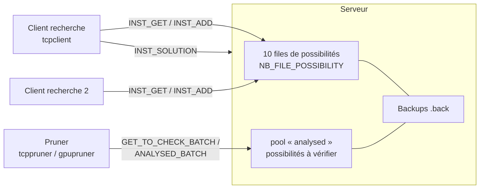
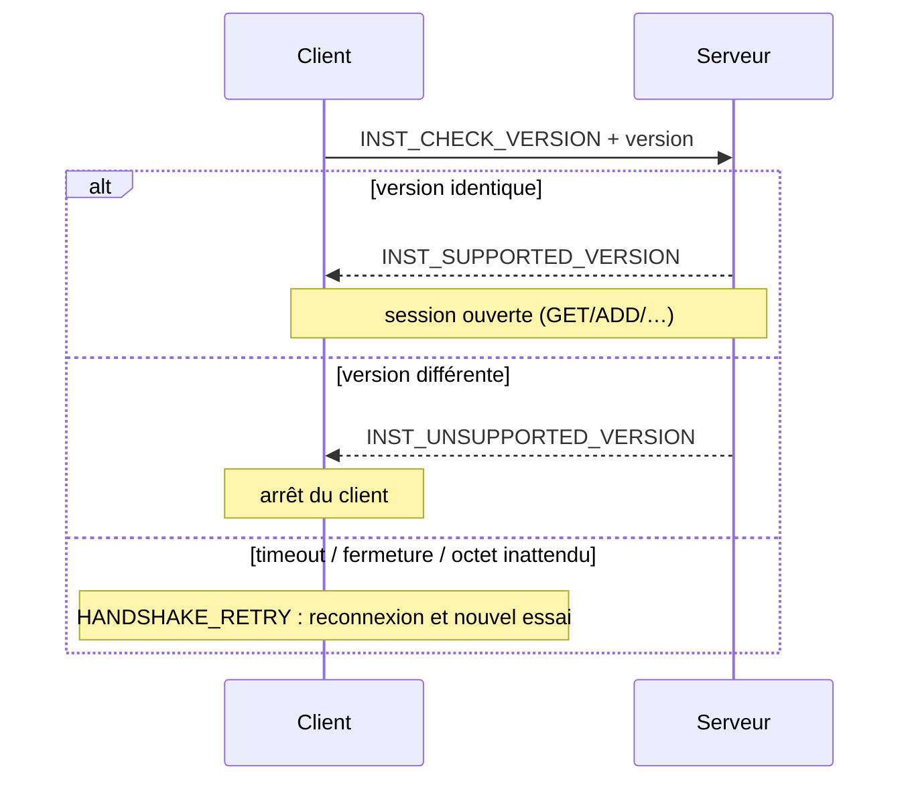
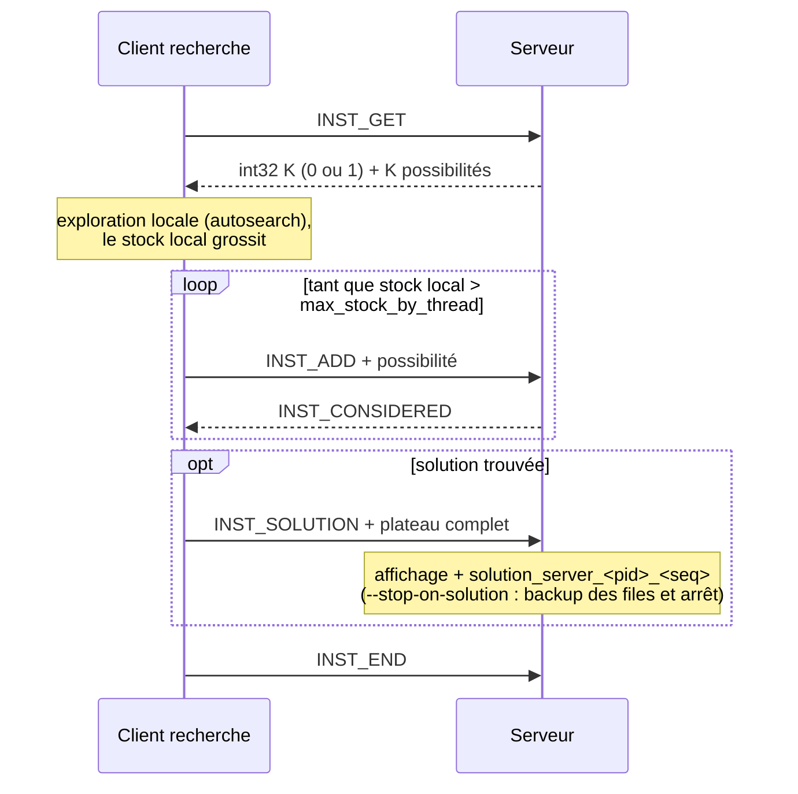
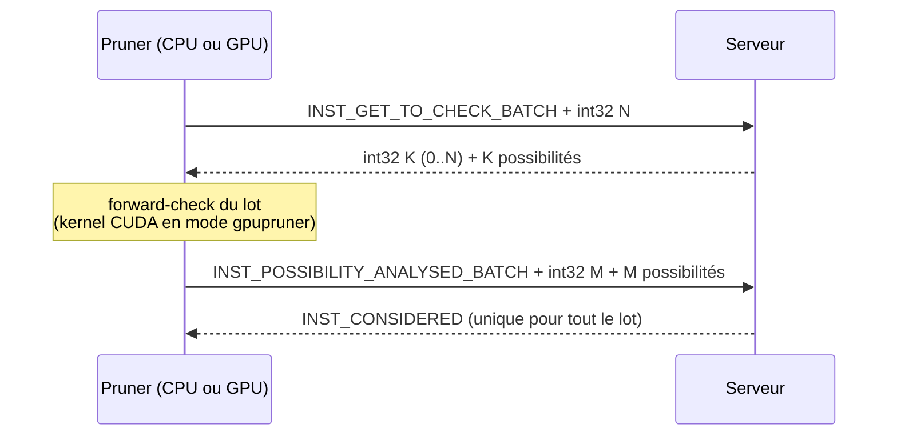
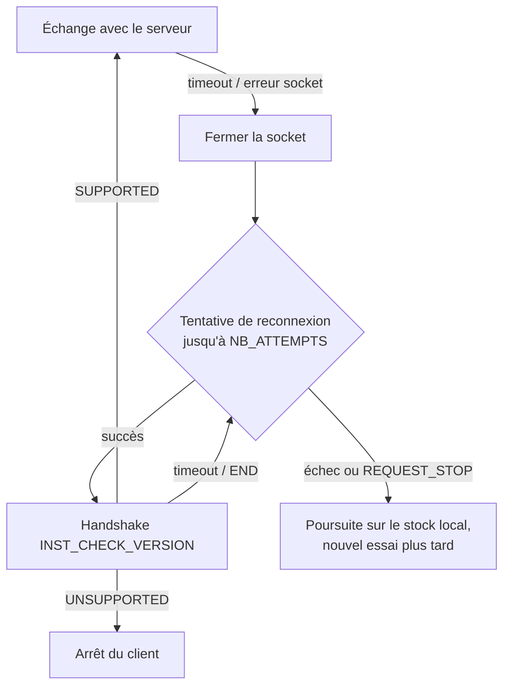

# Échanges client / serveur

Ce document décrit le protocole TCP qui relie le serveur (`tcpserver`) aux différents
clients (`tcpclient`, `tcppruner`, `gpupruner`) : les instructions échangées, la gestion
de charge, les séquences de communication typiques et le comportement en cas de panne.

Le code correspondant vit principalement dans :

- [src/net/etii_protocol.h](../src/net/etii_protocol.h) / [etii_protocol.c](../src/net/etii_protocol.c) — instructions, `send_all`/`recv_all`, handshake ;
- [src/net/tcpclient.c](../src/net/tcpclient.c) / [tcpserver.c](../src/net/tcpserver.c) — sockets et timeouts ;
- [src/core/datamanager.c](../src/core/datamanager.c) — files de possibilités côté serveur et échanges côté client ;
- [src/app/etii_server.c](../src/app/etii_server.c) / [etii_client.c](../src/app/etii_client.c) — boucles de traitement.

## Vue d'ensemble

Le serveur détient le stock global de **possibilités** (états de plateau partiels,
`struct possibility_packet`). Les clients de recherche en retirent (`INST_GET`), les
explorent localement, et redéposent l'excédent (`INST_ADD`). Les pruners retirent des
possibilités *non vérifiées* par lots, les valident (forward-check), puis signalent
celles à éliminer.

Chaque échange est un `packet` de taille fixe : un octet d'`instruction` suivi, selon
l'instruction, d'un `possibility_packet` (~520 octets). Depuis la version 7 du
protocole, **tous** les transferts de paquets passent par `send_all`/`recv_all`, qui
réassemblent les envois TCP partiels (voir [Robustesse](#comportement-en-cas-de-problème)).

## Types d'instructions

| Constante | Valeur | Sens | Rôle |
|---|---|---|---|
| `INST_ADD` | 1 | client → serveur | Dépose une possibilité (réponse : `INST_CONSIDERED`) |
| `INST_GET` | 2 | client → serveur | Demande une possibilité ; réponse : `int32` K + K paquets (K ∈ {0, 1}) |
| `INST_SOLUTION` | 3 | client → serveur | Envoie un plateau complet ; le serveur l'affiche et le sauvegarde |
| `INST_END` | 4 | bidirectionnel | Fin de session (aussi valeur de repli sur timeout de `recv_instruction`) |
| `INST_CONSIDERED` | 5 | serveur → client | Accusé de réception |
| `INST_NULL` | 6 | — | Hérité : plus émis depuis v7 (le compteur `int32` des réponses GET le remplace) |
| `INST_POSSIBILITY_ANALYSED` | 7 | pruner → serveur | Une possibilité vérifiée (unitaire) |
| `INST_TEST_CONNECTED` | 8 | client → serveur | Keepalive : le serveur renvoie la même instruction |
| `INST_CHECK_VERSION` | 9 | client → serveur | Ouverture du handshake de version |
| `INST_SUPPORTED_VERSION` | 10 | serveur → client | Version acceptée |
| `INST_UNSUPPORTED_VERSION` | 11 | serveur → client | Version refusée : le client s'arrête |
| `INST_GET_TO_CHECK` | 12 | pruner → serveur | Demande une possibilité non vérifiée (réponse : `int32` K + K paquets) |
| `INST_GET_TO_CHECK_BATCH` | 13 | pruner → serveur | Demande jusqu'à N possibilités en un aller-retour (`int32` N → `int32` K + K paquets) |
| `INST_POSSIBILITY_ANALYSED_BATCH` | 14 | pruner → serveur | Signale M possibilités analysées (`int32` M + M paquets → un seul `INST_CONSIDERED`) |

Toute évolution du format « fil » impose d'incrémenter `VERSION` : le handshake exige
une correspondance exacte.

### Handshake de version

À la connexion, le client envoie `INST_CHECK_VERSION` suivi de son numéro de version.

Point important : un `INST_END` reçu ici peut être un simple timeout de
`recv_instruction`, pas un refus — il est donc classé `HANDSHAKE_RETRY`, jamais
« version refusée ».

## Cycle de vie d'un client de recherche

## Cycle de vie d'un pruner (échanges par lots)

Le lot est borné par `pruner_batch_size` (4ᵉ argument CLI ou commande console
`prunerBatch <n>`, plafonné à `PRUNER_BATCH_MAX`), ce qui borne la mémoire du pruner
et divise le nombre d'allers-retours réseau par rapport au mode unitaire
(`INST_GET_TO_CHECK` / `INST_POSSIBILITY_ANALYSED`, conservé pour compatibilité).

## Gestion de charge

**Côté serveur — connexions simultanées configurables.** Le nombre de clients servis
en parallèle est le 1ᵉʳ argument de démarrage : `./eternityII tcpserver [nb_threads]`
(80 par défaut). Il dimensionne le pool de threads de communication — un thread par
connexion active — et sert aussi de backlog à `listen()`. Les slots sont créés
paresseusement : un client accepté est affecté à un slot libre, sinon un nouveau
slot est créé dans la limite de `NB_THREADS`. Si tous les slots sont occupés, la
boucle d'acceptation attend qu'un slot se libère (message « all threads busy »,
journalisé une seule fois par épisode d'attente) — la connexion reste en file, elle
n'est pas rejetée.

**Côté client — une connexion TCP par thread de recherche.** La connexion serveur
n'est **pas** partagée entre les workers : chaque contexte de recherche
(`client_possibility_t`, `src/app/etii_client.h`) possède son propre `socket_id`,
ouvert à la demande par `check_and_connect_to_server`. Un serveur avec N clients ×
M threads voit donc jusqu'à N×M connexions. Au sein d'un contexte, le socket est en
revanche partagé entre le thread de travail et le thread keepalive : le mutex
`socket_mutex` sérialise leurs échanges pour qu'une séquence
`send_instruction + send + recv ack` ne soit jamais entrelacée avec un ping.

**Côté client — seuil de stock local.** Chaque thread de recherche garde au plus
`max_stock_by_thread` possibilités en local (3ᵉ argument de `tcpclient`). Dès que sa
file ou son `big_table` dépasse ce seuil, l'excédent est délégué au serveur via des
`INST_ADD` (voir `src/core/etii_search.c`). Le client reste ainsi autonome (peu
d'allers-retours tant qu'il a du travail) tout en alimentant le stock global.

**Côté serveur — files multiples.** Le serveur répartit les possibilités sur
`NB_FILE_POSSIBILITY` (10) files protégées chacune par un mutex
(`src/core/datamanager.c`) : plusieurs threads serveur peuvent servir des clients en
parallèle sans se contendre sur un verrou unique. Un pool séparé « analysed » contient
les possibilités en attente de vérification, servi en priorité aux pruners et, en
repli, aux clients de recherche.

**Réponses GET explicites.** Depuis la v7, une réponse à `INST_GET` /
`INST_GET_TO_CHECK` commence par un compteur `int32` : `0` signifie « rien de
disponible » sans ambiguïté, ce qui évite à un client de bloquer en attente d'un
paquet qui ne viendra pas. Si le serveur ne fournit rien (stock épuisé ou serveur
saturé), le client continue sur son stock local et retentera plus tard.

**Batching pruner.** Les instructions `*_BATCH` amortissent la latence réseau : un
aller-retour pour N possibilités au lieu de N allers-retours, avec un seul
`INST_CONSIDERED` d'acquittement pour tout le lot.

**Persistance.** Le serveur sauvegarde périodiquement (et à l'arrêt) ses files dans
`./eternityII.back` et `./eternityII-in_analyse.back`, et les restaure au démarrage :
la charge accumulée survit à un redémarrage.

## Comportement en cas de problème

### Serveur qui ne répond plus

- **Timeouts socket.** Le client arme `SO_RCVTIMEO`/`SO_SNDTIMEO` à `tcp_timeout`
  secondes sur sa socket (`src/net/tcpclient.c`). Un `recv` qui expire fait renvoyer
  `INST_END` par `recv_instruction` (errno `EAGAIN`/`EWOULDBLOCK`/`ETIMEDOUT`) : le
  client ne reste jamais bloqué indéfiniment sur un serveur muet.
- **Keepalive.** Un worker occupé sur son stock local peut ne rien envoyer pendant
  longtemps ; côté serveur, `tcp_timeout` d'inactivité fermerait la connexion
  (Broken pipe). Un thread keepalive émet donc `INST_TEST_CONNECTED` toutes les
  `tcp_timeout/2` secondes pendant les périodes d'inactivité ; le serveur répond la
  même instruction. Cela distingue « client silencieux mais vivant » de « client mort ».
- **Détection côté client.** Si le keepalive ou un échange échoue, le client détecte la
  perte au plus tard après `tcp_timeout` et passe en reconnexion.

### Connexion impossible / reconnexion

`connect_to_server` tente jusqu'à `NB_ATTEMPTS` connexions, avec une pause de 1 s
entre chaque essai — découpée en tranches de 100 ms qui vérifient `REQUEST_STOP`,
pour qu'un Ctrl-C pendant la reconnexion ne soit pas bloqué. Après le dernier échec,
la fonction renvoie `-1` et l'appelant continue en local (le stock du thread n'est
pas perdu ; il sera redéposé quand le serveur reviendra).

### Flux TCP désynchronisé

Un `send()`/`recv()` brut peut ne transférer qu'une partie d'un paquet de ~520 octets
et désynchroniser tout le flux (les octets suivants seraient interprétés comme des
instructions). C'est pourquoi **tous** les transferts de `possibility_packet` passent
par `send_all`/`recv_all`, qui bouclent jusqu'à transfert complet ou erreur franche.
`recv_all` distingue le timeout (réessayable) de la fermeture propre (`recv == 0`).

### Arrêt et pertes de données

- À l'arrêt (signal ou `--stop-on-solution` après réception d'une solution), le
  serveur **sauvegarde ses files** dans les fichiers `.back` avant de quitter et les
  recharge au prochain démarrage.
- Les solutions sont écrites dans des fichiers **uniques**
  (`solution_<pid>_<seq>` côté client, `solution_server_<pid>_<seq>` côté serveur) :
  deux solutions ne s'écrasent jamais, même en cas de course.
- Une possibilité confiée à un **pruner** n'est pas retirée définitivement : elle reste
  dans le pool « en analyse » (sauvegardé dans `eternityII-in_analyse.back`) jusqu'à
  l'acquittement `INST_POSSIBILITY_ANALYSED[_BATCH]`. Si le pruner meurt, la
  possibilité est toujours côté serveur et sera resservie.
- Une possibilité remise à un **client de recherche** (`INST_GET`) est transférée : si
  ce client meurt avant d'avoir redéposé ses branches filles, cette portion de
  l'espace de recherche est perdue pour la session en cours.
