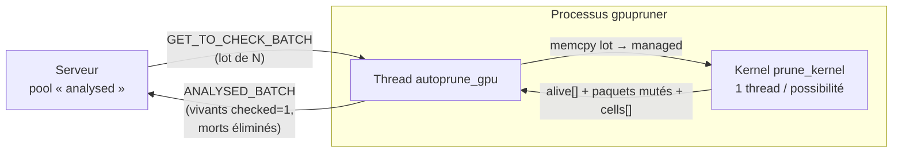

# Pruner GPU (CUDA)

Ce document décrit le mode **`gpupruner`** : un client pruner dont le contrôle des
possibilités est exécuté sur le GPU via CUDA, au lieu du CPU (`tcppruner`). Il couvre
les **pré-requis de compilation et d'exécution**, le **flux** de données, et les
**avantages** de ce mode.

Le code correspondant vit dans :

- [src/app/gpu_pruner.cu](../src/app/gpu_pruner.cu) / [gpu_pruner.h](../src/app/gpu_pruner.h) — kernel CUDA + interface C ;
- [src/core/etii_search.c](../src/core/etii_search.c) — `autoprune_gpu`, la boucle de vérification du thread ;
- [src/app/etii_client.c](../src/app/etii_client.c) — bascule `gpu_pruner_mode` (init/shutdown du contexte GPU) ;
- [src/app/main.c](../src/app/main.c) — dispatch du mode `gpupruner` ;
- [Makefile](../Makefile) — switch `CUDA=1` / `VERIFY=1`.

Le pruner GPU **n'est qu'une accélération** : le contrôle réalisé est strictement
équivalent à `possibility_all_has_a_next` (CPU), qui reste l'implémentation de
référence. Le protocole client/serveur est identique à `tcppruner` — voir
[Échanges client / serveur](echanges_client_serveur.md).

## Vue d'ensemble

Un pruner retire du serveur des possibilités *non vérifiées* par lots
(`INST_GET_TO_CHECK_BATCH`), contrôle pour chacune que toutes les cases vides ont
encore au moins une pièce candidate (forward-check), puis :

- **branche morte** → éliminée (`pruner_removed`), elle ne reviendra jamais dans le stock ;
- **branche vivante** → renvoyée marquée `checked = 1` (servie en priorité aux clients de recherche), avec les pièces forcées (cases à candidat unique) déjà placées.

Là où `tcppruner` contrôle les paquets **un par un** sur le CPU, `gpupruner`
soumet **tout le lot** au GPU en un seul appel (`gpu_pruner_check_batch`) : un thread
GPU par possibilité, tous exécutés en parallèle sur les multiprocesseurs.



## Pré-requis

### Compilation

| Pré-requis | Détail |
|---|---|
| **Toolkit CUDA** avec `nvcc` | `nvcc >= 11.2` (CI : CUDA 12.5). Le Makefile échoue explicitement si `nvcc` est introuvable dans le `PATH` (surcharge : `NVCC=/chemin/vers/nvcc`). |
| **Runtime CUDA** (`libcudart`) + `libstdc++` | Liés au binaire (`-lcudart -lstdc++`). Recherchés sous `$(CUDA_PATH)/lib64` (défaut `/usr/local/cuda`). |
| **Plateforme Linux/NVIDIA** | Le mode CUDA ne cible **pas** Darwin. Cible de référence : NVIDIA Jetson (Orin Nano). |
| **Architecture GPU** | `NVCC_ARCH` (défaut `sm_87` = Orin Nano). À adapter au GPU visé. |

```sh
# Build CUDA standard (Jetson Orin Nano)
make CUDA=1

# GPU d'une autre architecture
make CUDA=1 NVCC_ARCH=sm_75

# Toolkit hors du chemin par défaut
make CUDA=1 NVCC=/opt/cuda/bin/nvcc CUDA_PATH=/opt/cuda

# Vérification croisée GPU↔CPU activée (mise au point uniquement)
make CUDA=1 VERIFY=1
```

Sans `CUDA=1`, aucun `.cu` n'est compilé, `-DWITH_CUDA` est absent et le binaire est
**strictement identique** au build classique (le mode `gpupruner` n'existe alors pas).
`VERIFY=1` (`-DGPU_PRUNER_VERIFY`) rejoue le contrôle CPU pour chaque lot et logue toute
divergence (verdict vivant/mort ou contenu muté) — c'est un filet de mise au point, à
laisser à `VERIFY=0` en production.

> Sur les runners CI (sans GPU), le build CUDA est **compilé/lié uniquement** ; la
> validation fonctionnelle se fait sur Jetson. Avec `WERROR=1`, `-Werror all-warnings`
> est propagé à `nvcc` : tout diagnostic du code device devient une erreur.

### Exécution

| Pré-requis | Détail |
|---|---|
| **GPU CUDA présent** | `gpu_pruner_init` échoue proprement (abandon du processus) si aucun GPU n'est détecté. |
| **Mémoire unifiée recommandée** | Cible : SoC où GPU et CPU partagent la même DRAM (`integrated == 1`). Les buffers sont alloués en mémoire *managed* (`cudaMallocManaged`) → chemin **zéro-copie**, sans transfert PCIe. Sur GPU discret le code fonctionne mais la mémoire managed est migrée à la demande (perf. dégradée). |
| **Un serveur atteignable** | Même rôle que `tcppruner` : le pruner GPU est un client. |
| **Profil énergie/horloges** (Jetson, recommandé) | `sudo nvpmodel -m 0 && sudo jetson_clocks` pour le débit maximal. |

```sh
# Pruner GPU : mêmes arguments que tcppruner
./eternityII gpupruner [serveur] [nb_threads] [data/pieces.csv] [batch_size]
```

Le 4ᵉ argument (ou la commande console `prunerBatch <n>`, bornée par `PRUNER_BATCH_MAX`)
fixe la taille de lot. Le kernel est dimensionné pour traiter **tout un lot en un seul
lancement** (plusieurs blocs répartis sur tous les SM), d'où l'intérêt d'un lot large.

## Flux détaillé

1. **Initialisation (`gpu_pruner_init`, une fois par processus).** Le contexte CUDA
   n'étant **pas** hérité par `fork()`, l'init a lieu dans le processus qui exécutera
   le contrôle. On construit un **miroir GPU résident** de la table de lookup 4D :
   - `arena` (listes de candidats compactées) → `arena_dev` ;
   - les rotations (`all_rotate_part`) → `part_dev` ;
   - pour chaque clé du tableau 4D plat : `flat_off` (offset dans l'arène) + `flat_size`.

   > **Pourquoi ce miroir ?** Dans la map hôte, `flat[idx].parts` sont des **pointeurs
   > hôte** vers `map->arena` — invalides sur le device. On recopie donc l'arène de
   > façon contiguë et on indexe par offset. L'ordre de parcours des cases (`dirx`/`diry`)
   > est placé en mémoire constante (cache rapide).

2. **Consommation d'un lot.** Le thread `autoprune_gpu` récupère un lot du serveur et
   appelle `gpu_pruner_check_batch(packets, n, alive, cells)`. Le lot est copié dans les
   buffers managed, puis `prune_kernel` est lancé (`128` threads/bloc, un thread par
   possibilité).

3. **Kernel (`prune_kernel`) — parité stricte avec le CPU.** Chaque thread reproduit
   à l'identique `possibility_all_has_a_next` : balayage des cases de `alloc` à
   `ETERN_PARTS` suivant `dirx/diry`, sortie anticipée **uniquement** sur case morte
   (bucket vide), placement des pièces forcées (bucket de taille 1). Court-circuit si
   `checked == 1` (vivant sans recalcul). Un plateau complété fait passer `alloc` à
   `ETERN_PARTS` — le device ne peut pas `exit()`, c'est **l'hôte** qui détecte la
   solution.

4. **Retour à l'hôte.** Après `cudaDeviceSynchronize`, les buffers managed sont recopiés :
   paquets éventuellement mutés, `alive[]` (1 = vivant, 0 = mort) et `cells[]` (nombre de
   cases examinées par paquet, statistique de débit). Le thread renvoie alors les vivants
   (`checked = 1`), élimine les morts, et enregistre toute solution complète
   (`record_solution`).

5. **Robustesse.** Si le lancement kernel ou la synchronisation échoue, tout le lot est
   marqué **vivant** (conservateur : aucune possibilité perdue). Sur `REQUEST_STOP`, le
   lot est renvoyé tel quel.

6. **Arrêt (`gpu_pruner_shutdown`).** Libère le miroir et les buffers de travail.

## Avantages du mode GPU

- **Parallélisme massif.** Tout un lot de possibilités est contrôlé en un seul lancement
  kernel (un thread GPU par possibilité) au lieu d'un contrôle séquentiel par le CPU. Le
  forward-check est un motif régulier et indépendant par paquet — idéal pour le GPU.
- **Zéro-copie sur mémoire unifiée.** Sur Jetson (GPU/CPU même DRAM), les buffers *managed*
  ne subissent ni copie ni migration PCIe : le coût d'un lancement pour un lot de
  `PRUNER_BATCH_SIZE` se compte en microsecondes.
- **Débit de prunage accru** → plus de branches mortes éliminées par seconde, donc un
  stock serveur plus « propre » et des clients de recherche mieux alimentés en
  possibilités déjà vérifiées (`checked = 1`).
- **Décharge le CPU** de la Jetson : le pruning part sur le GPU, laissant les cœurs ARM
  disponibles pour d'autres clients de recherche.
- **Aucune régression sur le build standard.** Toute la logique CUDA est derrière
  `CUDA=1` / `WITH_CUDA` ; sans elle, le binaire est byte-identique au build classique.
- **Parité vérifiable.** Le mode `VERIFY=1` rejoue le contrôle CPU de référence et
  signale toute divergence — garantie que l'accélération GPU ne change pas les verdicts.

## Voir aussi

- [Échanges client / serveur](echanges_client_serveur.md) — protocole TCP, instructions pruner (`GET_TO_CHECK_BATCH`, `ANALYSED_BATCH`).
- [AGENTS.md](../AGENTS.md) — build CUDA, matrice CI, drapeaux de configuration.
